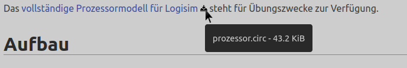
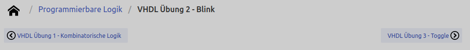

# ÆStatic

There are still too few static website building tools out there. Here's mine. I was working with
[pelican](https://getpelican.com/) before as static website builder, but I ended up with a mess of plugins to achieve
what I want. So how hard can it be to start your own static website builder? It's not that hard - about 500 lines of code.

# Features
## Markdown
This is similar to pelican. Each source file has a header with metadata and the body with the content:

```markdown
title: Timing in der Digitaltechnik
parent: uebersicht.md
latex: true

# Allgemeines
Bisher wurden die Elemente der kombinatorischen Schaltnetze und der sequentiellen Schaltwerke so betrachtet, dass jede Änderung eines diskreten Zustandes (logisch 0 oder 1) unmittelbar zu einer Änderung führt. Für reale Bauelemente gilt dies nicht, da jede Änderung mit einer bestimmten Verzögerung behaftet ist. Diese Verzögerungen kommen teils durch die Ausbreitungsgeschwindigkeit selbst oder durch Ladevorgänge innerhalb der Bauteile.
...
```

## Icons for links
Internal links are rendered as usual. Download links are rendered like this and have a tool tip telling filename and size:



External links are also marked as such:


## Breadcrumbs and forward/backward navigation



## How to build the website
### Using `venv` and `pip`
* (Optionally) create a virtual environment (eg. `python3 -m venv .venv; source .venv/bin/activate`)
* install via `pip install .` (or `pip install -e .` if you want to work on the source code)
* run `aestatic` - result is in folder ./output

### Using `poetry`
* run `poetry shell` and then `poetry install`
* run `aestatic` - result is in folder ./output
* optionally install jupyter notebooks with tensorflow and others using `poetry install --with jupyter`