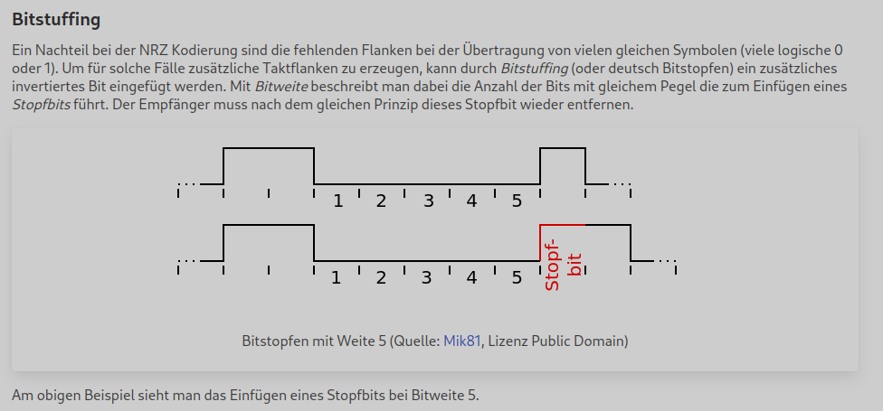
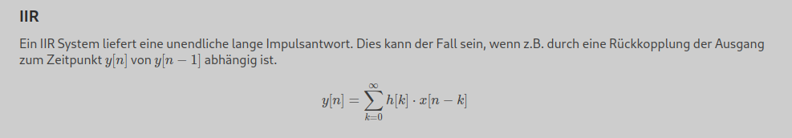

# ÆStatic

There are still too few static website building tools out there. Here's mine. I was working with
[pelican](https://getpelican.com/) before as static website builder, but I ended up with a mess of plugins to achieve
what I want. So how hard can it be to start your own static website builder? It's not that hard - about 500 lines of code.

## Features
### Markdown
This is similar to pelican. Each source file has a header with metadata and the body with the content:

```markdown
title: Timing in der Digitaltechnik
parent: uebersicht.md
latex: true

# Allgemeines
Bisher wurden die Elemente der kombinatorischen Schaltnetze und der sequentiellen Schaltwerke so betrachtet, dass jede Änderung eines diskreten Zustandes (logisch 0 oder 1) unmittelbar zu einer Änderung führt. Für reale Bauelemente gilt dies nicht, da jede Änderung mit einer bestimmten Verzögerung behaftet ist. Diese Verzögerungen kommen teils durch die Ausbreitungsgeschwindigkeit selbst oder durch Ladevorgänge innerhalb der Bauteile.
...
```

### Icons for links
Internal links are rendered as usual. Download links are rendered like this and have a tool tip telling filename and size:


External links are also marked as such:


### Breadcrumbs and forward/backward navigation


Breadcrumbs path is automatically generated from `parent` meta data in markdown files. The previous and next links are
automatically generated by the `next` meta data (`previous` is not needed).

### Processing of source and compressed folders

Folders containing sources which should not be included in the output have to get a suffix of `.source` in its folder name.
When a folder should be compressed to a `.zip` folder, add a suffix of `.compress`

### CSS file generation

CSS file is generated from SASS files. A suffix based on the git commit sha is automatically added to invalidate the 
webbrowser cache, when the content is updated.

### Permalinks for headings

Each heading is getting its own anchor for a permalink. When hovering over the heading a link to the anchor appears.

### Figures with source and license description

Title, author, source and license for figures can be added directly in the markdown source.

```markdown
.. figure:: bitstuffing.svg
    :title: Bitstopfen mit Weite 5
    :author: Mik81
    :source: https://commons.wikimedia.org/wiki/File:Bitstuffing.svg
    :license: Public Domain
```



### Multilingual pages

Pages can be written in english and german. The used language is indicated in the markdown meta data. For this site
german is the default and english is indicated by `english: true`.

### Latex rendering

Latex rendering is available when `latex: true` is found in the meta data of the page. Latex expressions are started
with `\\(` and ended with `\\)` for inline expressions. Paragraphs are surounded with `$$`.

```markdown
### IIR
Ein IIR System liefert eine unendliche lange Impulsantwort. Dies kann der Fall sein, wenn z.B. durch eine Rückkopplung
der Ausgang zum Zeitpunkt \\(y[n]\\) von \\(y[n-1]\\) abhängig ist.

$$y[n]=\sum\limits_{k=0}^\infty h[k] \cdot x[n-k]$$
```



## How to build the website
### Using `venv` and `pip`
* (Optionally) create a virtual environment (eg. `python3 -m venv .venv; source .venv/bin/activate`)
* install via `pip install .` (or `pip install -e .` if you want to work on the source code)
* run `aestatic` - result is in folder ./output

### Using `poetry`
* run `poetry shell` and then `poetry install`
* run `aestatic` - result is in folder ./output
* optionally install jupyter notebooks with tensorflow and others using `poetry install --with jupyter`