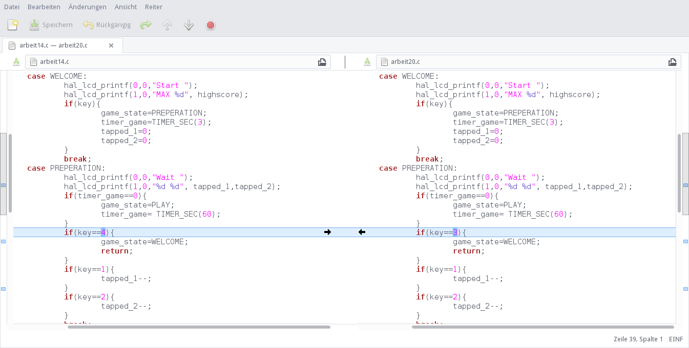
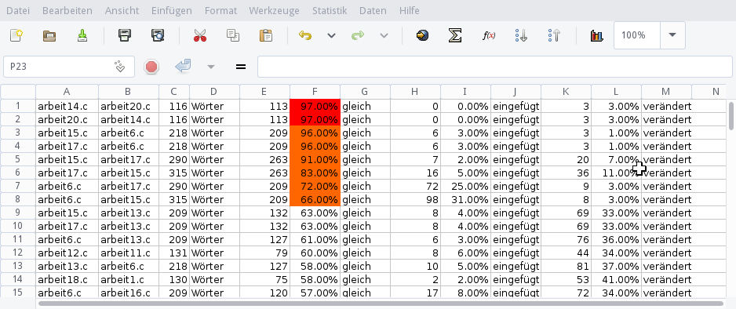

title: Interessante Korrelation entdecken mittels <samp>wdiff</samp>
date: 2016-01-31
image: meld_tb.png
latex: true

Abschreiben als solches zu erkennen ist keine einfache Sache, da der Aufwand massiv mit der Anzahl der zu vergleichenden
Arbeiten steigt. Bei 5 Arbeiten sind insgesamt 10 Vergleiche zu machen: Die erste Aufgabe wird mit den vier anderen
verglichen, dann die zweite Arbeit mit den drei verbleibenden, usw.

Mit <samp>wdiff</samp> habe ich ein Tool gefunden, um einfache Textvergleiche machen zu können.

Die Anzahl der Vergleiche ergibt sich dabei mittels den Binomialkoeffizienten zu:

$$N_{Vergleiche}={N_{Arbeiten} \choose 2}=\frac{N_{Arbeiten}!}{(N_{Arbeiten}-2)!\cdot 2!}$$

Anzahl der Arbeiten|Anzahl der Vergleiche
:-:|:-:
5|10
10|45
15|105
20|190
25|300
30|435

In der Informatik spricht man auch von einer Laufzeitkomplexität von \\(\mathcal O(n^2)\\), sprich mit doppelter Anzahl
an Arbeiten steigt die Anzahl der Vergleiche um (etwas mehr als) das Vierfache.

# Nutzen von Tools

Bei einer Hausaufgabe habe ich nun das konkrete "*Problem*" 25 Arbeiten miteinander zu vergleichen. Es handelt sich
um eine Programmieraufgabe in C.

Der Vergleich von zwei Textdateien lässt sich mittels `diff` bewerkstelligen. Was ich aber brauche ist eine Statistik,
die mir angibt, wie groß die *Korrelation* zwischen zwei Dateien ist, sprich wie groß der Anteil an Gemeinsamkeiten ist.
Bei dem Vergleich sollten Zeilenumbrüche, Leerzeichen, usw. keine Rolle spielen. Das Tool der Wahl ist `wdiff`. Die Option
`-s` liefert eine entsprechende Statistik.

    #!bash
    $> wdiff -s arbeit1.c arbeit2.c
    ...
    arbeit1.c: 126 Wörter  48 38% gleich  13 10% gelöscht  65 52% verändert
    arbeit2.c: 140 Wörter  48 34% gleich  7 5% eingefügt  85 61% verändert

Der Vergleich von <samp>arbeit1.c</samp> mit <samp>arbeit2.c</samp> liefert ein anderes Ergebnis als der umgekehrte Vergleich und
hängt vorallem mit der unterschiedlichen Anzahl an Gesamtworten zusammen.

Zum Vergleich von 25 Arbeiten müssen nun 300 dieser Aufrufe gemacht werden. Dazu dient folgendes <samp>bash</samp>-Skript:

```bash
files=`ls *.c`

for work1 in $files;
do
  for work2 in $files;
  do
    if [ $work1 == $work2 ]; then
      continue
    fi
    echo -n $work1 $work2
    wdiff -s $work1 $work2|tail -n 1|cut -d: -f2
  done
done
```

Das Skript nutzt zwei Schleifen, um jede Datei mit jeder zu vergleichen. Bei der Ausgabe von <samp>wdiff</samp> werden
nicht benötigte Teile weggeschnitten.

# Auswertung
Die Ausführung führt dann zu folgendem Ergebnis (ein Ausschnitt):

```
...
arbeit20.c arbeit13.c 209 Wörter  47 22% gleich  12 6% eingefügt  150 72% verändert
arbeit20.c arbeit14.c 116 Wörter  113 97% gleich  0 0% eingefügt  3 3% verändert
arbeit20.c arbeit15.c 315 Wörter  54 17% gleich  11 3% eingefügt  250 79% verändert
arbeit20.c arbeit16.c 209 Wörter  39 19% gleich  0 0% eingefügt  170 81% verändert
arbeit20.c arbeit17.c 290 Wörter  54 19% gleich  13 4% eingefügt  223 77% verändert
...
```

Es fällt der zweite Eintrag auf: 97% Übereinstimmung. Da muss sehr viel Zufall im Spiel sein, oder auch nicht.

Ein direkter Vergleich mittels [Meld](http://meldmerge.org/) zeigt:



Die Liste nach Korrelation sortiert zeigt folgendes Ergebnis:



Es zeigen sich zwei "*Cluster*": <samp>arbeit14.c</samp> und <samp>arbeit20.c</samp> unterscheiden sich durch genau drei "Wörter",
<samp>arbeit6.c</samp>, <samp>arbeit15.c</samp> und <samp>arbeit17.c</samp> unterscheiden sich auch nur durch ein paar "Wörter".

# Zusammenfassung
<samp>wdiff</samp> ist ein mächtiges Tool für Textvergleiche. Man sollte wahrscheinlich nicht zu pedantisch werden, um als Lehrer
Kopien zu entdecken. Ich wünsche und fordere eine Zusammenarbeit und Wissensaustausch bei Schülern - eine reine Kopie kann ich
aber nicht unterstützen.
