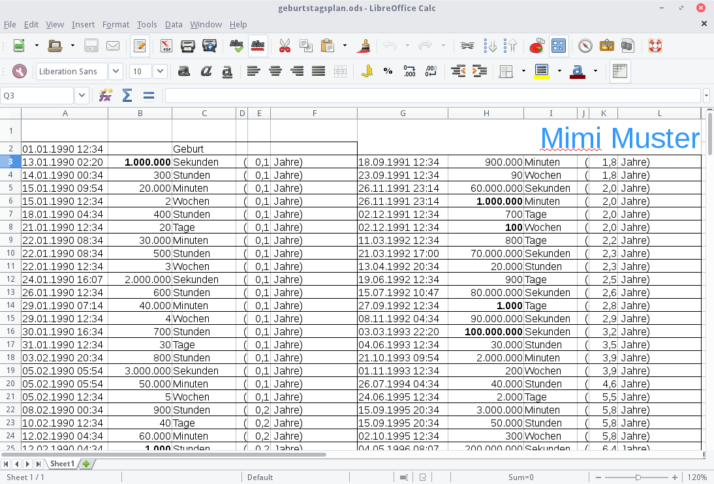
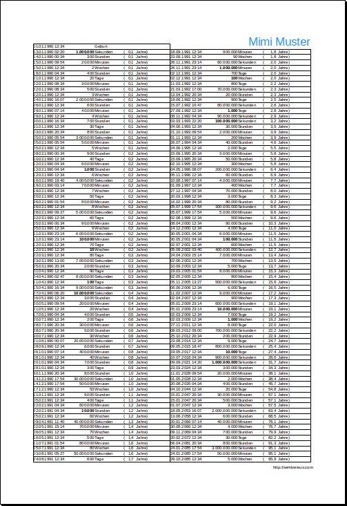

title: Jubiläumsplan
date: 2016-02-11
image: anniversary_tb.png

Wieso Jubiläen immer nur nach ganzen Jahren feiern? Wieso nicht bei einer Million Sekunden Lebenszeit? Oder bei Tausend Wochen?

Dieses [Spreadsheet](anniversary.ods) (LibreOffice Calc Sheet) macht es möglich. Einfach das Datum und die
Uhrzeit bei "Geburt" eintragen, Namen anpassen und ausdrucken.

Interessant ist die logarithmische Verteilung: Hat man eine Million Sekunden bereits nach elf einhalb Tagen erlebt,
braucht man für 10 Millionen Sekunden bereits fast vier Monate. 100 Millionen Sekunden sind nach knapp 3 Jahren erreicht
und bei einer Milliarde Sekunden ist man fast 32 Jahre alt.

Das Spreadsheet enthält die Jubiläen für Sekunden, Minuten, Stunden, Tage und Wochen. Es startet bei einer Million Sekunden
und endet beim letzten relevanten Jubiläum vor Erreichung der hundert Jahre - 5.000 Wochen (95.6 Jahre).

