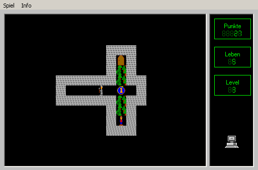

title: Der Tempel des Snofru
date: 2016-03-31
thumbnail: snofru_tb.gif

Das Spiel habe ich in jungen Jahren geschrieben und
es ist eine Sokoban-Variante (siehe [Wikipedia](https://de.wikipedia.org/wiki/Sokoban)). Ich dachte
eigentlich, dass das Spiel verschollen ist, doch Internet sei Dank hab ich es wieder gefunden.

Das Spiel (hier zum [Download](snofru.zip)) ist ziemlich einfach gestrickt. Man steuert eine Spielfigur mittels Pfeiltasten durch ein Labyrinth mit Hindernissen
in Form von verschiebbaren Steinen und herumlaufenden Soldaten.

## Archive.org

.. figure:: gamestar.jpg
    :title: GameStar 7/1998
    :author: Maniacfan
    :source: https://videospielzeitschriften.fandom.com/de/wiki/GameStar#1998
    :license: Urheberrechtlich geschützt durch GameStar

Wer [Archive.org](https://archive.org) nicht kennt, sollte es sich unbedingt anschauen. Ein Projekt
  zum Archivieren des Internets - und das nicht nur einmal, sondern in vielen Kopien zu verschiedenen Zeiten: Hier ist
die früheste Version meiner [Homepage](https://web.archive.org/web/20110201022701/http://www.semiversus.com/).

Und weil beim Archivieren des Internets wahrscheinlich nicht genug Daten anfallen archivieren sie auch viele frei zugängliche CDs, DVDs usw.

Das Spiel wurde damals auf der beiliegenden CD zur GameStar 7/1998 veröffentlicht - und diese CD gab es auch auf
Archive.org zum Download. Leider wurde es mittlerweile wieder entfernt.

## Das Spiel
Viele Dinge würde ich heute anders machen:

* Das Spiel läuft auf nur einer Plattform (Windows)
* Es wurde in VisualBasic programmiert
* Es ist nicht frei skalierbar
* Es ist nicht Open Source sondern Shareware...
* Der Gameplot entspricht der *Damsel in Distress* ([Youtube](https://www.youtube.com/watch?v=X6p5AZp7r_Q) - sehenswert).

Die Daten für die einzelnen Levels sind in der Datei <samp>Game.dat</samp> gespeichert. Jede Zeile entspricht einem Level.

Es gab sogar einen Leveleditor, aber nur in der Vollversion für 50 Schilling (inflationsangepasst wären das heute 6-7€).
Das Einkommen durch das Spiel hat für den Lebensunterhalt nicht gereicht und so hab ich dann die Schule fertig gemacht...
