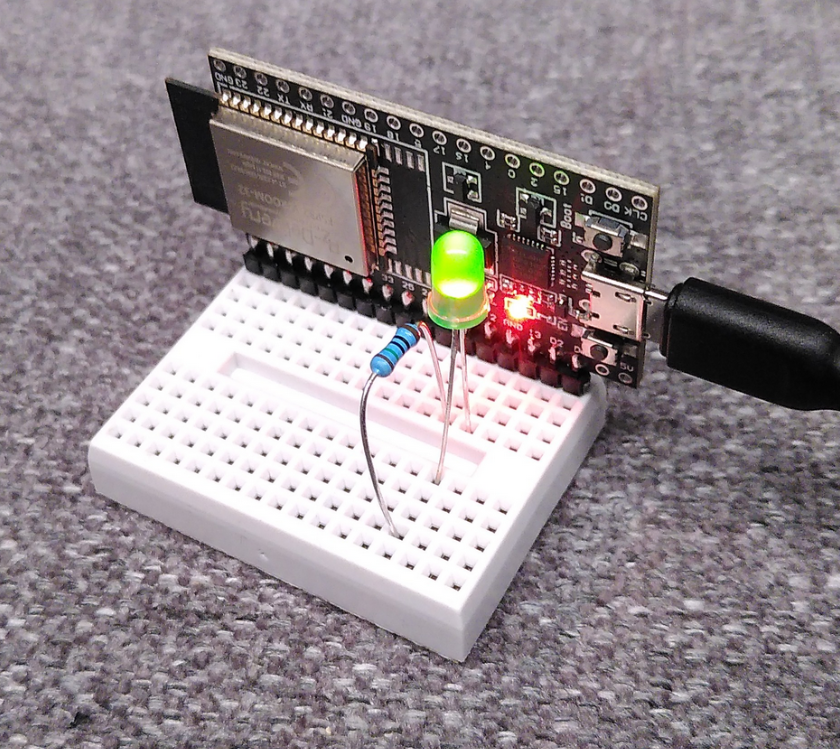

title: ESP-AT über USB
date: 2023-04-18
thumbnail: esp_tb.png
draft: true

Die [ESP-AT](https://github.com/espressif/esp-at) Firmware ist ein guter Einstieg, um sich mit der Hardware der ESP
Microcontroller zu beschäftigen oder im Unterricht vorzustellen. Mittels
[AT Befehle](https://de.wikipedia.org/wiki/AT-Befehlssatz) können so die verschiedenen Peripherieeinheiten genutzt
werden.

## Kommunikation über TTL UART
Im folgenden wird ein Dev. Kit Modul mit ESP32-WROOM-32 verwendet. Für andere ESP32 lässt sich die Information
entsprechend adaptieren.

Typischerweise besitzen ESP Microcontroller drei serielle Schnittstellen:
* **UART0** zum Flashen mittels Desktop PC über USB-UART Konverter
* **UART1** wird intern verwendet und steht nicht unmittelbar zur Verfügung
* **UART2** eine TTL UART für die eigentliche Anwendung

.. figure:: esp_uart_hw.png
    :title: Kommunikation mittels UART
    :author: Espressif Systems
    :source: https://docs.espressif.com/projects/esp-at/en/latest/esp32/Get_Started/Hardware_connection.html
    :license: © 2016

Die AT Firmware verwendet für die Kommunikation die UART2. Die ESP-AT Firmware wurde entwickelt, um ein bestehendes
Gerät mit den Funktionen des ESP32 erweitern zu können. Dazu wird über die UART2 das Gerät mit dem ESP32 verbunden und
dann über entsprechende AT Befehle die gewünschten Funktionen umgesetzt (z.B. WLAN Verbindungen aufbauen, GPIOs setzen,
...)

## Kommunikation über USB

.. figure:: esp_uart_hw2.png
    :title: Was wir wollen: Kommunikation mittels USB
    :author: Espressif Systems
    :source: https://docs.espressif.com/projects/esp-at/en/latest/esp32/Get_Started/Hardware_connection.html
    :license: © 2016

Um die Funktionalität des ESP32 über die bestehende USB Verbindung zu ermöglichen, ist es notwendig, die AT Firmware
anzupassen und selbst zu kompilieren.



### Vorbereitung
Die Anleitung zum Kompilieren findet sich in der Dokumentation:
[How to clone project and compile it](https://docs.espressif.com/projects/esp-at/en/latest/esp32/Compile_and_Develop/How_to_clone_project_and_compile_it.html)

Hier eine kurze Zusammenfassung:

```console
$ git clone --recursive https://github.com/espressif/esp-at.git
Cloning into 'esp-at'...
remote: Enumerating objects: 16019, done.
remote: Counting objects: 100% (1057/1057), done.
remote: Compressing objects: 100% (424/424), done.
remote: Total 16019 (delta 627), reused 1030 (delta 615), pack-reused 14962
Receiving objects: 100% (16019/16019), 143.96 MiB | 2.19 MiB/s, done.
Resolving deltas: 100% (10028/10028), done.
$ cd esp-at/
```

Für die Installation der Abhängigkeiten wird ein Tool verwendet. Während der Installation wird abgefragt, für welches
ESP32 die Installation vorbereitet werden soll.

```console
$ sudo ./build.py install
[sudo] password for user:
Ready to install ESP-IDF prerequisites..
Reading package lists... Done
...
```

Nach kurzer Zeit sind wir bei der Abfrage...

```
...
Successfully installed click-8.1.3 configparser-5.3.0 contextlib2-21.6.0 idf-component-manager-1.1.4 pycryptodome-3.15.0 requests-toolbelt-0.10.1 schema-0.7.5 tqdm-4.65.0
Platform name:
1. PLATFORM_ESP32
2. PLATFORM_ESP32C3
3. PLATFORM_ESP32C2
choose(range[1,3]):1

Module name:
1. WROOM-32
2. WROVER-32
3. PICO-D4
4. SOLO-1
5. MINI-1 (description: ESP32-U4WDH chip inside)
6. ESP32-SDIO
7. ESP32-D2WD (description: 2MB flash, No OTA)
choose(range[1,7]):1

Enable silence mode to remove some logs and reduce the firmware size?
0. No
1. Yes
choose(range[0,1]):0
Platform name:ESP32	Module name:WROOM-32	Silence:0
Cloning into submodule:"esp-idf" from "https://github.com/espressif/esp-idf.git" (This may take some time)..

...
...
```

Und jetzt wird es ein paar Minuten dauern...

```console
...

Cloning into 'esp-idf'...
remote: Enumerating objects: 447139, done.

...

      Successfully uninstalled idf-component-manager-1.2.2
Successfully installed configparser-5.3.0 cryptography-3.4.8 idf-component-manager-1.1.4 pycryptodome-3.15.0 xlrd-2.0.1

All done! You can now run:

  ./build.py build
```

### Anpassen der UART Pins

Wie in der [ESP-AT](https://docs.espressif.com/projects/esp-at/en/latest/esp32/Compile_and_Develop/How_to_set_AT_port_pin.html#modify-command-port-pins)
Doku beschrieben müssen die UART Pins von der TTL UART auf die USB UART umkonfiguriert werden. Dazu wird die entsprechende
Zeile für `WROOM-32` in der Datei `components/customized_partitions/raw_data/factory_param/factory_param_data.csv`
geändert:

```
PLATFORM_ESP32,WROOM-32,,0xfcfc,3,0,78,1,1,13,CN,115200,1,3,-1,-1,-1,-1
```

Durch diese Änderung wird das TX Signal auf Pin 1 gelegt und das RX Signal auf Pin 3.

Optional können noch weitere Einstellungen mittels `./build.py menuconfig` vorgenommen werden.

### Kompilierung

```console
$ ./build.py build
```