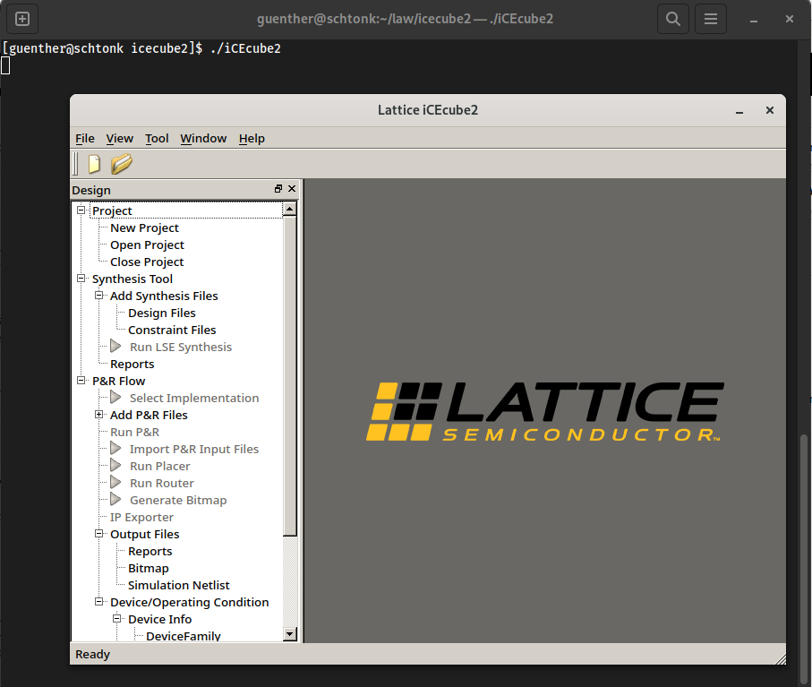

title: Install Lattice iCEcube2 on Linux
date: 2023-09-29
thumbnail: lattice_tb.jpg
english: true

Do you have troubles installing iCEcube2 on your Linux computer? Lattice is providing a Linux installation for iCEcube2 [here](https://www.latticesemi.com/Products/DesignSoftwareAndIP/FPGAandLDS/iCEcube2).

Following the installation instruction I ran into following issue:
```console
$ unzip iCEcube2setup_Dec_10_2020_2012_lin.zip
Archive:  iCEcube2setup_Dec_10_2020_2012_lin.zip
  inflating: iCEcube2setup_Dec_10_2020_2012
```

```console
$ chmod +x iCEcube2setup_Dec_10_2020_2012
```

```console
$ ./iCEcube2setup_Dec_10_2020_2012
bash: ./iCEcube2setup_Dec_10_2020_2012: cannot execute: required file not found
```

*iCEcube2* is a 32 bit executable and very probably you're running a 64 bit Linux. The solution? Install the 32 bit dependencies.

## Fedora
To get iCEcube2 installed on Fedora (tested on Fedora 38):

### 32bit dependencies
```console
$ sudo dnf install glibc.i686 libXext.i686 libSM.i686 libXi.i686 libXrender.i686 libXrandr.i686 libXfixes.i686 libXcursor.i686 libXinerama.i686 freetype.i686 libpng12.i686

...
  Verifying        : libxml2-2.10.4-1.fc38.i686                                                                                                                                                                                                                                                                         44/45
  Verifying        : p11-kit-0.25.0-1.fc38.i686                                                                                                                                                                                                                                                                         45/45

Installed:
  bzip2-libs-1.0.8-13.fc38.i686          cairo-1.17.8-4.fc38.i686               fontconfig-2.14.2-1.fc38.i686          freetype-2.13.0-2.fc38.i686              glib2-2.76.5-2.fc38.i686              glibc-2.37-5.fc38.i686                 glibc-gconv-extra-2.37-5.fc38.i686          gmp-1:6.2.1-4.fc38.i686
  gnutls-3.8.1-1.fc38.i686               graphite2-1.3.14-11.fc38.i686          harfbuzz-7.1.0-1.fc38.i686             libICE-1.0.10-10.fc38.i686               libSM-1.2.3-12.fc38.i686              libX11-1.8.6-1.fc38.i686               libXau-1.0.11-2.fc38.i686                   libXcursor-1.2.1-3.fc38.i686
  libXext-1.3.5-2.fc38.i686              libXfixes-6.0.0-5.fc38.i686            libXi-1.8.1-1.fc38.i686                libXinerama-1.1.5-2.fc38.i686            libXrandr-1.5.2-10.fc38.i686          libXrender-0.9.11-2.fc38.i686          libblkid-2.38.1-4.fc38.i686                 libbrotli-1.0.9-11.fc38.i686
  libffi-3.4.4-2.fc38.i686               libgcc-13.2.1-1.fc38.i686              libidn2-2.3.4-2.fc38.i686              libmount-2.38.1-4.fc38.i686              libpng-2:1.6.37-14.fc38.i686          libpng12-1.2.57-17.fc38.i686           libseLinux-3.5-1.fc38.i686                  libsepol-3.5-1.fc38.i686
  libstdc++-13.2.1-1.fc38.i686           libtasn1-4.19.0-2.fc38.i686            libunistring-1.1-3.fc38.i686           libunistring1.0-1.0-1.fc38.i686          libuuid-2.38.1-4.fc38.i686            libxcb-1.13.1-11.fc38.i686             libxml2-2.10.4-1.fc38.i686                  nettle-3.8-3.fc38.i686
  p11-kit-0.25.0-1.fc38.i686             pcre2-10.42-1.fc38.1.i686              pixman-0.42.2-1.fc38.i686              xz-libs-5.4.1-1.fc38.i686                zlib-1.2.13-3.fc38.i686

Complete!
```

### `eth0` device
The license manager is searching for a `eth0` device to compare the MAC address. To achieve this, we have to tell the linux kernel while booting.

Add `net.ifnames=0` to GRUB_CMLINE_LINUX in the file `/etc/default/grub`:

<div class="highlight"><pre><span></span><span class="nv">GRUB_TIMEOUT</span><span class="o">=</span><span class="m">5</span>
<span class="nv">GRUB_DISTRIBUTOR</span><span class="o">=</span><span class="s2">&quot;</span><span class="k">$(</span>sed<span class="w"> </span><span class="s1">&#39;s, release .*$,,g&#39;</span><span class="w"> </span>/etc/system-release<span class="k">)</span><span class="s2">&quot;</span>
<span class="nv">GRUB_DEFAULT</span><span class="o">=</span>saved
<span class="nv">GRUB_DISABLE_SUBMENU</span><span class="o">=</span><span class="nb">true</span>
<span class="nv">GRUB_TERMINAL_OUTPUT</span><span class="o">=</span><span class="s2">&quot;console&quot;</span>
<span class="nv">GRUB_CMDLINE_LINUX</span><span class="o">=</span><span class="s2">&quot;rd.luks.uuid=luks-ff974974-8e99-4833-ab19-af4bd2b0a201 rhgb quiet </span><span class="s2 hll">net.ifnames=0</span><span class="s2">&quot;</span>
<span class="nv">GRUB_DISABLE_RECOVERY</span><span class="o">=</span><span class="s2">&quot;true&quot;</span>
<span class="nv">GRUB_ENABLE_BLSCFG</span><span class="o">=</span><span class="nb">true</span>
</pre></div>

Now we need to re-build the grub bootloader:
```console
$ grub2-mkconfig -o /boot/grub2/grub.cfg
```

Now we are ready to reboot.

### Install
Install iCEcube2 by starting the installer:

```console
$ ./iCEcube2setup_Dec_10_2020_2012
```

### Extend library path
I was still unable to start iCEcube2 and after digging a while, here is the solution. Adding `/usr/lib/` to the library path helped. Open the `config.xml` path in the iCEcube2 installation path and add the path:

<div class="highlight"><pre><span></span><span class="nt">&lt;Starter&gt;</span>
<span class="w"> </span><span class="nt">&lt;ProductId</span><span class="w"> </span><span class="na">organizationName=</span><span class="s">&quot;Lattice&quot;</span><span class="w"> </span><span class="na">organizationDomain=</span><span class="s">&quot;latticesemi.com&quot;</span><span class="nt">&gt;</span>iCEcube<span class="w"> </span>2008.6<span class="nt">&lt;/ProductId&gt;</span>
<span class="w"> </span><span class="nt">&lt;Environment&gt;</span>
<span class="w">  </span><span class="nt">&lt;LM_LICENSE_FILE</span><span class="w"> </span><span class="na">append=</span><span class="s">&quot;0&quot;</span><span class="w"> </span><span class="na">userInput=</span><span class="s">&quot;LM_LICENSE_FILE&quot;</span><span class="nt">&gt;</span>/home/guenther/license.dat<span class="nt">&lt;/LM_LICENSE_FILE&gt;</span>
<span class="w">  </span><span class="nt">&lt;SBT_DIR</span><span class="w"> </span><span class="na">append=</span><span class="s">&quot;0&quot;</span><span class="nt">&gt;</span>$(RootPath)/sbt_backend<span class="nt">&lt;/SBT_DIR&gt;</span>
<span class="w">  </span><span class="nt">&lt;LD_LIBRARY_PATH&gt;</span><span class="hll">/usr/lib/:</span>$(RootPath)/sbt_backend/lib/linux/opt:$(RootPath)/sbt_backend/bin/linux/opt/synpwrap:$(RootPath)/LSE/bin/lin<span class="nt">&lt;/LD_LIBRARY_PATH&gt;</span>
<span class="w">  </span><span class="nt">&lt;TCL_LIBRARY&gt;</span>$(RootPath)/sbt_backend/bin/linux/lib/tcl8.4<span class="nt">&lt;/TCL_LIBRARY&gt;</span>
<span class="w"> </span><span class="nt">&lt;/Environment&gt;</span>
<span class="nt">&lt;/Starter&gt;</span>
</pre></div>

### Starting iCEcube2
Now starting should work as expected.



## Ubuntu
You find a detailed installation guide on [vhdlwiz.com](https://vhdlwhiz.com/lattice-icecube2-ubuntu-20-04-icestick/).

## General advice `cannot execute: required file not found`
This message is not really helpful. Use `file` to see if the executable is a 32-bit file (or maybe even another processor architecture).

```console
$ file iCEcube2setup_Dec_10_2020_2012
iCEcube2setup_Dec_10_2020_2012: ELF 32-bit LSB executable, Intel 80386, version 1 (SYSV), dynamically linked, interpreter /lib/ld-linux.so.2, for GNU/Linux 2.2.5, not stripped
```

The first thing missing here is `glibc` for the required architecture. See the following chapters how to install.
```console
$ sudo dnf install glibc.i686  # or whatever is needed to get glibc for the required architecture onto your system
```

After installing `glibc`, you get more information.
```console
$ ./iCEcube2setup_Dec_10_2020_2012
./iCEcube2setup_Dec_10_2020_2012: error while loading shared libraries: libz.so.1: cannot open shared object file: No such file or directory
````

Now we have at least a clue about what is missing...
