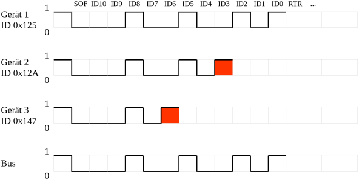

title: CAN Bus
parent: uebersicht.md

# Allgemeines
**CAN** steht für *Controller Area Network* und ist ein serielles Feldbussystem. Die Entwicklung von CAN startete 1983 bei
Bosch mit dem Ziel, die Vernetzung der Steuergeräte in Fahrzeugen zu vereinfachen. CAN ist ein ISO-Standard (11898) und
findet weite Verwendung im Automobil- sowie Automatisierungsbereich.

Der CAN-Standard definiert die beiden Schichten 1 und 2 des ISO/OSI-Schichtenmodells (Bitübertragungsschicht und Sicherungsschicht).

# Bitübertragungsschicht
Für die Übertragung wird neben der gemeinsamen Masse ein differentielles Signal verwendet, welches über die beiden
Signalpfade <samp>CAN+</samp> und <samp>CAN-</samp> (oft auch <samp>CAN_HIGH</samp> und <samp>CAN_LOW</samp> genannt) läuft.

Der Bus arbeitet nach dem Multi-Master-Prinzip, d. h. jede Komponente kann aktiv auf den Bus zugreifen. Ein
<abbr title="Carrier Sense Multiple Access/Collision Resolution">CSMA/CR</abbr>-Verfahren stellt sicher, dass Nachrichten
mit höherer Priorität nicht durch gleichzeitig startende Nachrichten mit niedrigerer Priorität beschädigt werden
(siehe [Arbitrierung](can.html#arbitrierung)).

Die beiden logischen Werte 0 und 1 werden mittels zweier Zustände übermittelt. Die logische 1 wird dabei *rezessiv* übertragen,
die logische 0 wird *dominant* übertragen. Durch diese zwei Zustände setzt sich am Bus eine logische 0 gegenüber einer gleichzeitig
anliegenden logischen 1 durch.

Ein wichtiges Grundprinzip von CAN ist, dass jeder aktive Sender während der Übertragung den Zustand des Busses überwacht.
Wenn der Bus einen anderen Zustand hat, als der Sender selbst auf den Bus legt, wird die Übertragung abgebrochen.

Je nach Leitungslänge des Busses gibt es Limitierungen für die Datenrate:

* 1 MBit/s bis 40 Meter
* 500 kBit/s bis 100 Meter
* 125 kBit/s bis 500 Meter

Als Busmedium wird meist ein Twisted-Pair-Kabel mit einem Wellenwiderstand von ungefähr 110 Ohm verwendet.

# Arbitrierung
Jedes Datentelegramm enthält am Anfang des Pakets eine 11-Bit-Identifikationsnummer (direkt hinter einem *Start of Frame*-Bit).
Im CAN-2.0-B-Standard wird darüber hinaus auch eine 29 Bit lange Identifikationsnummer definiert.

Sobald ein Paket erfolgreich übertragen wurde und der Bus damit frei ist, hat jeder Sender die Möglichkeit, ein Datentelegramm zu schicken.
Übertragen mehrere Sender zeitgleich ein Paket, wird mittels der *Arbitrierung* das Paket mit der höchsten Priorität ermittelt.
Dazu übertragen die Teilnehmer Bit für Bit der Identifikationsnummer, beginnend mit dem höchstwertigen Bit. Wird eine logische
1 ausgesendet, eine logische 0 aber vom Bus zurückgelesen, beendet der Teilnehmer die Übertragung.

Je niedriger die Identifikationsnummer, desto höher die Priorität. Ein Paket mit der ID 0 hat alle Bits auf logisch 0,
und diese wird sich gegen alle anderen IDs durchsetzen.

.. info:: Eindeutigkeit der ID

    Identifikationsnummern identifizieren das Datentelegramm, nicht den Teilnehmer selbst! Für ein CAN-System
    muss sichergestellt werden, dass Identifikationsnummern eindeutig sind.

## Beispiel
Im folgenden Beispiel senden drei Teilnehmer ein Paket. Die Identifikationsnummern der Datentelegramme sind dabei:

* <samp>0x125</samp> – Binär <samp>001 0010 0101</samp>
* <samp>0x12A</samp> – Binär <samp>001 0010 1010</samp>
* <samp>0x147</samp> – Binär <samp>001 0100 0111</samp>

Als erstes scheidet ID 0x147 aus. Bei Bit <samp>ID6</samp> wird vom Teilnehmer eine logische 1 gesendet, am Bus hat sich
aber die logische 0 der beiden anderen Teilnehmer durchgesetzt. Gleiches passiert bei ID 0x12A bei Bit <samp>ID3</samp>.

# Sicherungsschicht

.. figure:: can_telegramm.svg
    :title: Aufbau eines CAN-Telegramms im Base-Frame-Format
    :author: Endres~commonswiki
    :source: https://commons.wikimedia.org/wiki/File:CAN-Bus-frame_in_base_format_without_stuffbits.svg
    :license: CC BY-SA 3.0

Ein Datentelegramm besteht aus folgenden Feldern:

* **Start of Frame** – markiert den Start eines Frames und ist logisch 0
* **Arbitration Field** – überträgt die 11 Bit Identifikation und ein **Remote Transmission Request**-Flag
* **Control**
  * **ID Extension**-Bit – muss logisch 0 für eine 11-Bit-Identifikation sein (logisch 1 bei 29 Bit)
  * **Data Length** – Anzahl an Datenbytes (0 bis 8)
* **Data** – Datenbytes (im Bild wird ein Datenbyte übertragen)
* **CRC Field** – CRC-Prüfsumme
* **ACK Slot** – wird vom Sender mit logisch 1 gesendet, ein Empfänger sendet bei Erfolg logisch 0
* **End of Frame** – 7 rezessive Bits

Der **Remote Transmission Request** (kurz RTR) ist eine Möglichkeit, von einem Teilnehmer Daten anzufordern. Dazu wird ein Telegramm
mit der gewünschten Identifikationsnummer und dem RTR-Bit auf logisch 1 gesendet.
