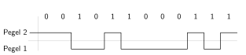
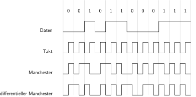

title: Kanalkodierung
parent: uebersicht.md

# Allgemeines
Um Informationen in digitaler Form zu übertragen, müssen sie über ein physikalisches Medium transportiert werden. Die Kanalkodierung – genauer: der Leitungskode – beschreibt die Pegelfolgen, in denen die Daten auf der Leitung dargestellt werden. Dies kann in elektrischer, optischer oder elektromagnetischer Form erfolgen.

## Synchrone und asynchrone Übertragung
Bei der **synchronen Übertragung** wird ein Taktsignal mitgeschickt. Der Empfänger kann sich dadurch mit dem Sender synchronisieren und die Daten korrekt empfangen.

Bei der **asynchronen Übertragung** arbeiten Sender und Empfänger mit jeweils eigener Taktfrequenz. Die Übertragung erfolgt entweder mit einer genau definierten Symbolrate oder die Symbole selbst ermöglichen die Rückgewinnung des Takts (z. B. durch Flankenwechsel im Signalverlauf).

## Gleichspannungsfreiheit
In bestimmten Anwendungen ist die Übertragung von Gleichspannungsanteilen nicht möglich – etwa wenn das Signal zur galvanischen Trennung über einen Impulstransformator geführt wird. Das Signal sollte daher im Mittel einen Spannungswert von null aufweisen. Kodierungen, die dies gewährleisten, werden als *gleichspannungsfrei* bezeichnet.

# Binäre Leitungskodes

## NRZ (Non Return to Zero)
Im einfachsten Fall werden den logischen Zuständen 0 und 1 jeweils feste Pegel auf der physischen Leitung zugeordnet.

Bei der RS232-Schnittstelle steht (entgegen dem obigen Beispiel) eine **negative** Spannung für logisch 1 und eine **positive** Spannung für logisch 0.

### Bitstuffing
Ein Nachteil der NRZ-Kodierung ist das Fehlen von Signalflanken bei langen Folgen gleicher Bits (viele logische 0 oder 1). Um zusätzliche Taktflanken zu erzeugen, kann durch *Bitstuffing* (auch *Bitstopfen*) ein zusätzliches invertiertes Bit eingefügt werden. Mit *Bitweite* bezeichnet man dabei die maximale Anzahl gleicher Bits, nach der ein Stopfbit eingefügt wird. Der Empfänger muss dieses Stopfbit nach dem gleichen Prinzip wieder entfernen.

.. figure:: bitstuffing.svg
    :title: Bitstopfen mit Weite 5
    :author: Mik81
    :source: https://commons.wikimedia.org/wiki/File:Bitstuffing.svg
    :license: Public Domain

Im obigen Beispiel wird ein Stopfbit nach fünf gleichen Bits eingefügt.

## NRZI (Non Return to Zero Inverted)
Bei der *NRZI-Kodierung* wird einem der beiden Bitwerte (z. B. logisch 0) der aktuelle Leitungszustand zugeordnet, dem anderen (z. B. logisch 1) ein Wechsel des Pegels (Inversion). Dadurch ist NRZI bei differentieller Übertragung polaritätsunempfindlich: Ein Verpolen der Leitung ändert die Bitfolge nicht.

Längere Folgen ohne Pegelwechsel können jedoch zur Synchronisationsverlust führen – auch hier kann Bitstuffing helfen.

In diesem Beispiel bedeutet logisch 1 einen Pegelwechsel, logisch 0 keine Änderung.

# Manchester-Kodierung
Bei der Manchester-Kodierung wird eine logische 0 durch eine steigende Flanke (0→1), eine logische 1 durch eine fallende Flanke (1→0) innerhalb eines Bitintervalls dargestellt. Dadurch werden:

* stets Pegelwechsel zur Taktrückgewinnung gewährleistet,
* und der Gleichspannungsanteil des Signals bleibt im Mittel null.

Ein Nachteil ist die Verdopplung der benötigten Symbolrate gegenüber der reinen Bitrate.

Beim **differentiellen Manchester-Code** bedeutet ein Flankenwechsel am Taktanfang eine logische 0 (zwei Flankenwechsel pro Bit), während bei einer logischen 1 kein Wechsel am Taktanfang erfolgt (nur ein Flankenwechsel pro Bit).

# Blockcodes
Bei Blockcodes werden mehrere Bits zu Symbolgruppen zusammengefasst und in alternative Codewörter überführt.

Der **4B5B-Code** bildet je 4 Bit auf 5-Bit-Codewörter ab – also 16 mögliche Datenworte auf 32 verschiedene Codes. Dieser Code ist nicht gleichspannungsfrei, enthält aber stets mindestens einen Pegelwechsel zur Taktrückgewinnung.

Der **8B10B-Code** wird häufig in der Telekommunikation eingesetzt. Dabei werden 8 Datenbits auf 10 Leitungssymbole abgebildet. Dadurch ist eine Gleichspannungsfreiheit gewährleistet und der Takt kann aus dem Signal zurückgewonnen werden. Der Overhead beträgt hier 25 %.

Ein effizienterer Code ist der **64B66B-Code**, der 64 Bit auf 66 Leitungssymbole abbildet und somit nur etwa 3 % Overhead erzeugt.

Blockcodes können auch zur Fehlererkennung und -korrektur verwendet werden. Dazu wird jedem Informationswort der Länge *m* ein Codewort der Länge *n* zugeordnet (wobei *n > m*). Die hinzugefügte Redundanz senkt zwar die Informationsrate, ermöglicht dem Empfänger jedoch die Erkennung und ggf. Korrektur von Übertragungsfehlern.
