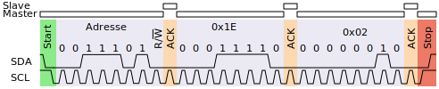
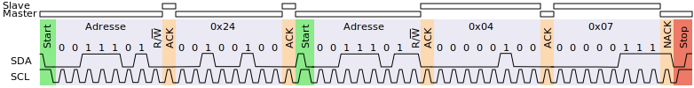

title: I²C Übungsaufgaben
parent: i2c.md

# Aufgabe ADXL345

In dieser Übung wird der Beschleunigungssensor [ADXL345](https://www.analog.com/en/products/adxl345.html) von [Analog Devices](https://www.analog.com/en/index.html) angesteuert. Die Angaben stammen aus dem entsprechenden [Datenblatt](https://www.analog.com/media/en/technical-documentation/data-sheets/ADXL345.pdf).

Die 7-Bit-Adresse des Bausteins ist für diese Übung mit <samp>001 1101</samp> (0x1D) gegeben.

## Register

Der Baustein verfügt über mehrere Register mit einer Breite von jeweils einem Byte.

.. figure:: adxl345_registers.svg
    :title: Registerübersicht
    :author: Datenblatt ADXL345
    :source: https://www.analog.com/media/en/technical-documentation/data-sheets/ADXL345.pdf
    :license: © Analog Devices

Die folgende Abbildung zeigt vier typische Übertragungsarten:

* Schreiben eines Bytes in ein Register
* Schreiben mehrerer Bytes in aufeinanderfolgende Register
* Lesen eines Bytes aus einem Register
* Lesen mehrerer Bytes aus mehreren Registern

.. figure:: adxl345_overview.svg
    :title: Lesen und Schreiben einzelner sowie mehrerer Bytes
    :author: Datenblatt ADXL345
    :source: https://www.analog.com/media/en/technical-documentation/data-sheets/ADXL345.pdf
    :license: © Analog Devices

**Hinweise zur Abbildung:**

1. Das dargestellte *START* ist entweder ein *Repeated START* oder ein *STOP* mit anschließendem *START*
2. Der grau schattierte Bereich markiert die Phasen, in denen die jeweilige Komponente den Buszustand überwacht

## Beispiele

Schreiben des Wertes 0x02 in das Register `OFSX` (0x1E):

Lesen der Register `THRES_ACT` und `THRES_INACT` (0x24 und 0x25):

## Aufgabenstellung

Skizziere die folgenden Übertragungen am I²C-Bus:

1. **Schreiben des Registers `DUR`** mit dem Wert <samp>0x05</samp>
2. **Schreiben der Register `OFSX`, `OFSY`, `OFSZ`** mit den Werten <samp>[0x17, 0x2A, 0x04]</samp> (mit nur einem Zugriff)
3. **Lesen des Registers `ACT_TAP_STATUS`**, bei angenommenem Inhalt <samp>0x10</samp>
4. **Lesen der Register `DATAX0` bis `DATAY1`**, bei angenommenem Inhalt <samp>[0x08, 0xE3, 0x01, 0xA7]</samp> (mit nur einem Zugriff)
