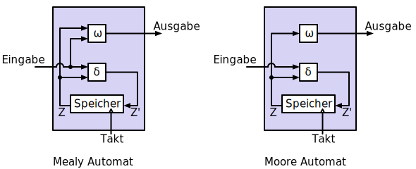
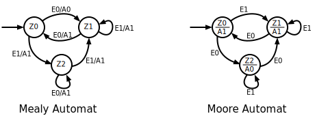
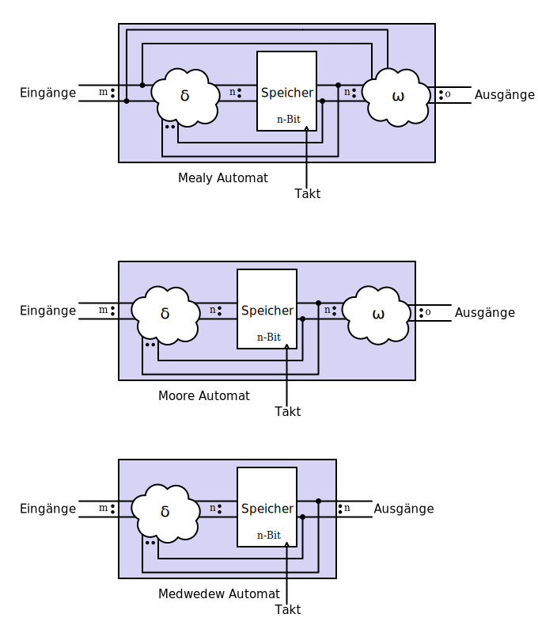

title: Automatentheorie
parent: uebersicht.md

.. info:: Übungsblatt

    Zu diesem Teil gibt es [Übungsaufgaben](uebung_automatentheorie.html)

# Allgemeines
Die Automatentheorie beschreibt Modelle, die durch die im Automat vorhandenen Zustände, den akzeptierten Eingaben und durch die Ausgaben beschrieben werden können. Wenn ein Automat nur endlich viele Zustände einnehmen kann, spricht man von einem „endlichen Automaten“. Andere Ausdrücke sind Zustandsmaschine oder der englische Ausdruck „Finite State Machine“.

## Mathematische Beschreibung
### Eingabealphabet `Σ`
Das Eingabealphabet (oder auch Eingabemenge) beschreibt die Menge aller vorkommenden Eingaben, die durch den Automaten bearbeitet werden können und wird durch das Zeichen `Σ` (großes Sigma) dargestellt.

Eine Eingabe kann zum Ändern des Zustands des Automaten und zu einer Ausgabe führen.

### Ausgabealphabet `Γ`
Analog zum Eingabealphabet beschreibt das Ausgabealphabet `Γ` (großes Gamma) die Menge aller vorkommenden Ausgaben des Automaten.

Man kann zwischen vier Typen unterscheiden, zu welchem Zeitpunkt eine Ausgabe gemacht wird:

* **Eintritt in einen Zustand**: Sobald in einen neuen Zustand eingetreten wird, wird die Ausgabe gemacht. Dazu ist für jeden Zustand eine bestimmte Eintrittsaktion definiert.
* **Austritt aus einem Zustand**: Sobald aus einem Zustand ausgetreten wird, wird die Ausgabe gemacht. Hier wird auch für jeden Zustand eine bestimmte Austrittsaktion definiert.
* **Eingabe bei einem Zustand**: Hier wird je nach Zustand und Eingabe eine entsprechende Ausgabe gemacht.
* **Zustandsübergang**: Zu jedem Zustandsübergang wird eine entsprechende Ausgabe definiert.

### Zustandsmenge `S`
Die Zustände, die ein Automat einnehmen kann wird durch die endliche Menge `S` beschrieben.

### Anfangszustand `s0`
Der Anfangszustand `s0` ist ein Zustand aus der Zustandsmenge `S` und beschreibt den Zustand, den der Automat nach der Inbetriebnahme einnimmt.

### Zustandsübertragungsfunktion `δ`
Die Zustandsübertragungsfunktion δ (klein Delta) beschreibt den Wechsel in einen neuen Zustand in Abhängigkeit des aktuellen Zustandes und der Eingabe. Die Zustandsübertragungsfunktion kann gut als Tabelle dargestellt werden:

δ|**E0**|**E1**|**E2**
:---:|:---:|:---:|:---:
**Z0**|Z0|Z1|Z2
**Z1**|Z2|Z2|Z0
**Z2**|Z0|Z0|Z0

Bei diesem Beispiel ist `S`={`Z0`, `Z1`, `Z2`} und `Σ`={`E0`, `E1`, `E2`}. In den Zeilen sind alle Zustände, in den Spalten alle Eingänge dargestellt. Nun kann bei einem bestimmten Zustand und einer bestimmten Eingabe abgelesen werden, in welchen Zustand dadurch gewechselt wird. Als Beispiel wird im Zustand `Z0` wird bei der Eingabe `E1` in den Zustand `Z1` gewechselt.

### Ausgabefunktion `ω`
Die Ausgabefunktion `ω` (klein Omega) beschreibt die Ausgabe in Abhängigkeit von Zustand und Eingabe oder auch nur vom Zustand (vergleiche ''Moore''- und ''Mealy''-Automat). Falls die Ausgabefunktion von Zustand und Eingabe abhängig ist, lässt sich die Funktion auch gut als Tabelle darstellen:

ω|**E0**|**E1**|**E2**
:---:|:---:|:---:|:---:
**Z0**|A0|A2|A0
**Z1**|**A1**|A1|A2
**Z2**|A2|A1|A1

In diesem Beispiel ist `Γ`={`A0`, `A1`, `A2`}. Hier wird als Beispiel beim Zustand `Z1` und der Eingabe `E0` die Ausgabe `A1` gemacht.

## Moore- und Mealy-Automat
Bei der Ausgabefunktion gibt es zwei verschiedene Definitionen: Einmal hängt die Ausgabe von Zustand und Eingabe ab und das andere mal nur vom Zustand. Ein Automat, dessen Ausgabe von Zustand und Eingabe abhängt wird „Mealy“-Automat genannt. Im Gegensatz dazu hängt bei einem „Moore“-Automat die Ausgabe nur vom aktuellen Zustand ab.

Dies kann in folgendem Diagramm zusammengefasst werden:

Es ist möglich, einen gegebenen „Mealy“-Automaten in einen „Moore“-Automaten umzuwandeln und umgekehrt. Für viele Aufgabenstellungen kommt der „Mealy“-Automat mit weniger Zuständen aus, da die Eingänge auch direkt die Ausgänge beeinflussen können. Um das selbe zu erreichen, benötigt der „Moore“-Automat mehr Zustände, da die Ausgänge immer vom aktuellen Zustand abgeleitet werden.

## Beispiel Getränkeautomat
Als Beispiel wird ein Getränkeautomat entworfen, der 50 Cent und 1 Euro Geldstücke akzeptiert. Außerdem gibt es eine Taste für die Getränkeausgabe und die Geldrückgabe. Der Getränkeautomat kann 50 Cent und 1 Euro Stücke zurückgeben, sowie ein Getränk ausgeben. Ein Getränk kostet 1 Euro.

Dadurch können wir unsere Ein- und Ausgabemenge definieren:

**Eingabemenge**: `Σ`={"50 Cent", "1 Euro", "Rückgabetaste", "Getränketaste"}

**Ausgabemenge**: `Γ`={"50 Cent", "1 Euro", "Getränk", "Keine Ausgabe"}

Als Zustände des Automaten definieren wir das aktuelle Guthaben.

**Zustandsmenge**: `S`={"0 Euro", "50 Cent", "1 Euro"}

Da beim Start des Automaten noch kein Geld eingeworfen wurde, definieren wir "0 Euro" als Startzustand.

**Startzustand**: `s0`="0 Euro"

Für das Erstellen der Zustandsübertragungsfunktion müssen wir definieren, wie der Automat reagieren soll. Wird mehr als 1 Euro eingeworfen, soll das Geld über einem 1 Euro ausgegeben werden und weiterhin 1 Euro Guthaben behalten werden. Die Taste ''Rückgabe'' soll jederzeit das vorhandene Guthaben ausgeben. Die Taste ''Getränkeausgabe'' soll nur ein Getränk ausgeben, wenn 1 Euro Guthaben vorhanden ist.

**Zustandsübertragungsfunktion**:

δ | **50 Cent** | **1 Euro** | **Rückgabetaste** | **Getränketaste**
:---:|:---:|:---:|:---:|:---:
**0 Euro** | 50 Cent | 1 Euro | 0 Euro | 0 Euro
**50 Cent** | 1 Euro | 1 Euro | 0 Euro | 50 Cent
**1 Euro** | 1 Euro | 1 Euro | 0 Euro | 0 Euro

Für die volle Funktionsbeschreibung unseres Getränkeautomaten benötigen wir noch die Ausgabefunktion `ω`.

**Ausgabefunktion**:

ω | **50 Cent** | **1 Euro** | **Rückgabetaste** | **Getränketaste**
:---:|:---:|:---:|:---:|:---:
**0 Euro** | Keine Ausgabe | Keine Ausgabe | Keine Ausgabe | Keine Ausgabe
**50 Cent** | Keine Ausgabe | 50 Cent | 50 Cent | Keine Ausgabe
**1 Euro** | 50 Cent | 1 Euro | 1 Euro | Getränk

Anhand der Beschreibung der einzelnen Mengen und Funktionen kann man nun die Funktion des Automaten vollständig beschreiben. Interessant bei diesem Beispiel ist die Tatsache, dass der Getränkeautomat "rechnen" kann: Bei 50 Cent Guthaben und 1 Euro Einwurf werden 50 Cent zurückgegeben und das Guthaben ist 1 Euro. Genauso wird beim Einwurf von zwei 50 Cent Stücken und dem Drücken der Taste "Rückgabe" ein 1 Euro Geldstück zurückgegeben. Die "Berechnung" selbst wurde aber nur implizit durch die Zustandsübertragungs- und Ausgabefunktion beschrieben.

# Graphische Darstellung
Bisher kamen wir mit einer rein mathematischen Darstellung aus. In der Praxis ist es aber viel einfacher sich ein Bild von den Zuständen und den Übergängen zu machen. Dazu wird das sogenannte ''Zustandsübertragungsdiagramm'' genutzt.

Die Darstellungsform für Mealy- oder Moore-Automat unterscheiden sich:

Zustände werden als Kreise dargestellt. Die Bezeichnung des Zustands befindet sich innerhalb des Kreises. Der Startzustand wird mit einem Pfeil markiert, der keinen Zustand als Ursprung hat (hier `Z0`). Die Übergänge werden mittels Pfeilen dargestellt. Der Beschreibung des Pfeils enthält die Eingabe, die für diesen Zustandswechsel notwendig ist. Beim Mealy-Automat sind die Ausgaben vom Zustand und der Eingabe abhängig, deshalb wird die Ausgabe in der Beschreibung des entsprechenden Pfeils hinzugefügt. Beim Moore-Automat ist die Ausgabe nur vom Zustand abhängig, deshalb wird die Ausgabe innerhalb des Kreises hinzugefügt.

# Anwendung in der Digitaltechnik
Bisher gingen wir von allgemeinen Ein- und Ausgaben aus. In der Digitaltechnik sind dies nun Ein- und Ausgänge, die ausschließlich mit den beiden digitalen Zuständen 0 und 1 arbeiten. Die Kennwerte für einen digitalen Automat sind die Anzahl der Ein- und Ausgänge sowie die Anzahl der Flip-Flops.

Mit `n` Flip-Flops lassen sich `2^n` Zustände darstellen.

Bei den digitalen Automaten kommt neben dem schon bekannten Moore- und Mealy-Automat noch der Medwedew-Automat dazu. Dieser endliche Automat hat keine Ausgabefunktion sondern stellt die Ausgänge der einzelnen Speicherelemente direkt als Ausgänge zur Verfügung. Bei der Erstellung eines Medwedew-Automat müssen daher die Zustände entsprechend der gewünschten Ausgänge gewählt werden. Der Medwedew-Automat ist eine Sonderform des Moore-Automaten.
