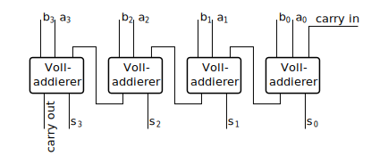
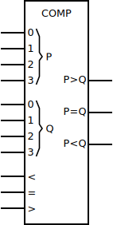

title: Grundlegende Schaltnetze
parent: uebersicht.md

# Allgemeines
Es gibt viele Schaltnetze, deren Funktion häufig eingesetzt wird. Dabei werden die Schaltnetze nicht mehr auf der Ebene der Logikgatter betrachtet, sondern die Funktionalität wird abstrahiert.

## Multiplexer
Ein Multiplexer (auch oft kurz "Mux") selektiert aus mehreren Eingängen einen einzelnen aus und gibt den Wert, der an diesem Eingang anliegt am Ausgang aus. Man unterscheidet die Multiplexer nach Anzahl der Eingänge. Die einfachste Form ist ein Multiplexer mit zwei Eingängen.

In der Wahrheitstabelle wird ersichtlich, dass nur der jeweils ausgewählte Eingang den Ausgang beeinflusst. Ist <code>s0</code>=0 so gilt <code>a</code>=<code>e0</code>, bei <code>s0</code>=1 gilt <code>a</code>=<code>e1</code>.

s0|e1|e0|a
:---:|:---:|:---:|:---:
0|x|0|0
0|x|1|1
1|0|x|0
1|1|x|1

Bei mehr als zwei Eingängen ist auch mehr als ein Selektionseingang notwendig.

## Halb-Addierer
Der Halb-Addierer dient zur Addition von zwei einstelligen Binärzahlen. Als Ausgang stehen das Summenbit und ein Übertragsbit (engl. <code>Carry</code>)  zur Verfügung. Der Übertrag wird benötigt, sobald man zwei mindestens zweistellige Binärzahlen addieren will.

x|y|s|c
:---:|:---:|:---:|:---:
0|0|0|0
0|1|1|0
1|0|1|0
1|1|0|1

## Voll-Addierer
Der Voll-Addierer berücksichtigt einen Übertrag aus einer vorhergehenden Stufe. Der Voll-Addierer kann mittels zwei Halb-Addierer realisiert werden.

Um nun zwei 4 Bit Zahlen zu addieren, werden insgesamt vier einzelne Addierer benötigt, die jeweils zwei Bit unter Berücksichtigung eines Übertrages der Vorstufe addieren. Der Addierer, der die niederwertigsten Bits addiert kann auch ein Halbaddierer sein, da kein Übertrag beachtet werden muss. Wird ein Voll-Addierer genutzt, muss der entsprechende Übertragseingang auf <code>0</code> gesetzt werden.

## Komparator
Ein Komparator vergleicht zwei Binärzahlen gleicher Bitbreite miteinander. Eine einfache Ausführung des Komparators hat dabei nur einen "ist gleich"-Ausgang. Sind also beide Zahlen gleich groß, so wird der "ist gleich"-Ausgang auf <code>1</code> gesetzt. Eine Erweiterung stellt die Variante mit zusätzlichem "größer"- und "kleiner"-Ausgang dar.

Um mehrere Komparatoren zu kombinieren, sind Eingänge für "ist gleich", "größer" und "kleiner" Signale der Vorstufe notwendig.

## Prioritätsenkoder
Der Prioritätsenkoder gibt die Nummer des aktiven Eingangs aus, der die höchste Priorität hat. Im folgenden Beispiel gibt es vier Eingänge (<code>i0</code> bis <code>i3</code>), wobei <code>i3</code> die höchste Priorität hat. Ist <code>i3</code> aktiv, wird am Ausgang der Wert 3 (<code>y1</code>=1, <code>y0</code>=1), unabhängig davon, welchen Zustand die anderen Eingänge haben.

i3|i2|i1|i0|y1|y0
:---: | :---: | :---: | :---: | :---: | :---:
0|0|0|0|0|0
0|0|0|1|0|0
0|0|1|x|0|1
0|1|x|x|1|0
1|x|x|x|1|1
