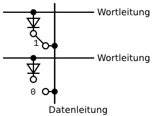
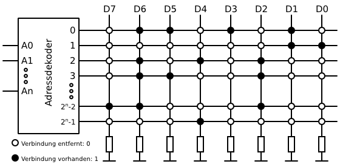

title: Statische Datenspeicher
parent: uebersicht.md
latex: true

# Allgemeines

Bei statischen Speichern wird keine zyklische Erneuerung der Information benötigt, da der Zustand in der Speicherzelle stabil gespeichert wird.

# Festwertspeicher
## Masken ROM
Bei einem Masken ROM (Read-Only-Memory) handelt es sich um einen Festwertspeicher, dessen Speicherinhalt durch den Fertigungsprozess über Masken fest angelegt wird. Diese Art von Speicher ist nur für sehr große Massenfertigung sinnvoll, da die Erstellung von individuellen Masken sehr teuer ist. Die Anwendung muss auch so ausgelegt sein, dass es keine Notwendigkeit von nachträglichen Updates gibt. Für den Großteil der heutigen Endkundenprodukte ist so etwas unvorstellbar geworden.

Die Ansteuerung erfolgt durch die Wort- und Datenleitung. Eine Speicherzelle wird selektiert, indem die Wortleitung auf logisch 1 gesetzt wird. Wenn die Verbindung durch die Maske erzeugt wurde, wird über diese Verbindung die Datenleitung auch auf logisch 1 gezogen. Die Datenleitung bleibt auf logisch 0, wenn die Verbindung nicht vorhanden ist.

Um ungewollte Rückwirkungen zu vermeiden werden Dioden benötigt, da meist mehrere Speicherzellen gleichzeitig angesprochen werden. Die Wortleitung selbst wird durch einen Adressdekoder gesteuert.

## OTP ROM
Beim OTP (One-Time-Programmable) ROM handelt es sich um eine Speicherstruktur die einmal programmierbar ist. Der Aufbau ist vergleichbar mit dem Masken ROM, nur hier ist jede Verbindung anfangs vorhanden. Jede Verbindung ist so ausgelegt, dass bei einem hohen Strom die Verbindung verdampft, ähnlich einer Sicherung. So ist am Anfang jede Speicherzelle auf logisch 1 und kann durch den Schreibvorgang auf eine logisch 0 geändert werden. Dieser Vorgang ist jederzeit möglich, die Umkehrung (logisch 0 auf 1) jedoch nicht.

# Nicht-Flüchtiger Speicher
## EPROM

Ein EPROM (Erasable Programmable ROM) ist ein Speicher, der gleich einem OTP ROM programmierbar ist. Der Speicherinhalt kann mittels UV-Licht gelöscht werden.

### Programmiervorgang

Beim Programmieren wird eine erhöhte Spannung (je nach Bauart zwischen 12 Volt und 25 Volt) angelegt. Dadurch kommt es zu einem Lawinen-Durchbruch (oder Avalanche-Durchbruch). Dadurch können Elektronen die dünne Isolierschicht überwinden und sich im Floating Gate sammeln.

Das Programmieren kann jederzeit wiederholt bzw. fortgesetzt werden, allerdings kann man nur Ladungen auf dem Floating Gate einbringen und diese nicht wieder abtransportieren.

Es wird meist zwischen zwei verschiedenen Programmieralgorithmen unterschieden. Beim langsamen Programmieren wird die maximale Programmierzeit, die der Herstellers des Bausteins angibt, verwendet. Dies kann je nach Hersteller zwischen einigen 100µs bis einigen Millisekunden dauern.

Beim schnellen Programmieren werden wesentlich kürzere Programmierzeiten verwendet (etwa 100µs). Nach einem Programmiervorgang wird das Ergebnis zurückgelesen und sollten nicht genug Ladungen auf das Floating Gate gelangt sein, wird dieser Vorgang wiederholt. Nachdem das erste Mal das richtige Ergebnis zurückgelesen wird, wird ein etwas längerer Programmiervorgang gestartet (etwa 300µs) um noch zusätzliche Ladungsträger auf das Floating Gate zu bringen. Damit ist der Programmiervorgang für diese Zelle abgeschlossen.

### Auslesen
Der Transistor schaltet durch, wenn nun am Gate eine Spannung von etwa 5 Volt angelegt wird und das Floating Gate keine Ladungsträger enthält (wurde also nicht programmiert). Beim Durchschalten zieht der Transistor den Pegel der Datenleitung auf Massepotential. Wenn am Floating Gate Ladungsträger vorhanden sind, verschiebt sich die Schwellenspannung und die 5 Volt am Gate reichen nicht mehr aus, den Transistor durchzuschalten. Der Pegel der Datenleitung wird also nicht auf Masse gezogen und bleibt auf einem hohen Pegel.

### Löschen
Um nun die Information zu Löschen bzw. den Speicherbaustein auf seinen Auslieferungszustand zurückzusetzen wird nun mittels UV Licht im Bereich von 250nm der Widerstand der Isolierschicht heruntergesetzt und damit können die Elektronen Richtung Substrat abfließen.

Damit dies überhaupt möglich wird, ist ein Quarzglas im Chip notwendig. Nach dem Löschen wird dies meist mit einem nicht transparenten Aufkleber abgedeckt.

<figure><figcaption>EPROM mit Quarzfenster (Bild: <a href="https://commons.wikimedia.org/wiki/File:16Mbit_EPROM_ST_Microelectronics_M27C160_(1).jpg">yellowcloud</a> CC BY 2.0)</figcaption></figure>

Der Löschvorgang dauert je nach Intensität zwischen 20 Minuten und mehreren Stunden. Da die Isolationsschicht sich bei jedem Löschvorgang verschlechtert geben die Hersteller meist eine Beschreibbarkeit (oder genauer Löschbarkeit) von einigen Hundert Zyklen an.

Da die Isolationsschicht nicht ideal isoliert fließen über längere Zeit auch die Elektronen aus dem Floating Gate ab. Die Hersteller geben meist eine Zeit von ca. 10 Jahren an, in der ein EPROM seine Information behalten kann. Umwelteinflüsse (erhöhte Umgebungstemperatur, Röntgenstrahlung, ...) können diesen Vorgang beschleunigen.

## EEPROM
Eine EEPROM (Electrically-Erasable PROM) Speicherzelle ist im Prinzip ähnlich wie ein EPROM aufgebaut. Die Isolationsschicht zwischen dem Floating Gate und Drain ist hier aber so dünn, dass es auch bei geringen Spannungen von ca. 12 Volt zu einem sogenannten Tunneleffekt kommt. Dieser quantenmechanische Effekt ermöglicht das Durchwandern von Elektronen durch die dünne Isolationsschicht in beide Richtungen. Es können also Elektronen auf das Floating Gate hinzugefügt oder abgetragen werden.

Da der Transistor mit dem Floating Gate je nach gespeichertem Datum einen selbstsperrenden Zustand aufweisen kann, wird ein zweiter Transistor benötigt, um die Speicherzelle zu adressieren.

Ein Programmiervorgang benötigt je nach Typ zwischen 1ms und 10ms. Die Wiederbeschreibbarkeit liegt meist bei maximal 100.000 Schreibvorgängen.

## Flash
Eine Flash Speicherzelle entspricht einer EEPROM Speicherzelle, nur wird hier durch eine Änderung der Schaltung nicht mehr jede Speicherzelle einzeln löschbar. Die Speicherzellen werden zu sogenannten ''Pages'' zusammengefasst. Je nach Typ ist eine solche Page meist einige kByte groß. Durch diese Änderung wird der zweite Transistor zur Adressierung nicht mehr benötigt und es kann somit eine höhere Speicherdichte erreicht werden.

Die Spannung zum Schreiben und Löschen (ca. 12V) wird heute meist durch integrierte Ladungspumpen realisiert. Die Beschreibbarkeit liegt meist bei einigen 100.000 Schreibvorgängen.

### SLC vs. MLC
In einer Single-Level-Cell wird nur zwischen vorhandener und nicht vorhandener Ladung (also logisch 0 oder 1) unterschieden. Wenn man nun mehrere Zwischenstufen nutzt, kommt man zur sogenannten Multi-Level-Cell. Wenn man zwischen 4 Ladungszuständen unterscheiden kann, können 2 Bit pro Speicherzelle gespeichert werden.

MLC Flash Speicher erhöhen die Speicherdichte (mehr Bit auf gleiche Fläche), die Transferrate (mehr Bit pro Zugriff). allerdings auch den Leistungsbedarf.

# Flüchtiger Speicher
## SRAM

SRAM Zellen werden heut meist mittels 6 Transistoren in einer CMOS Technologie gefertigt. Die Information wird in einer bistabilen Kippstufe (M1-M4) gespeichert. Die beiden Transistoren M5 und M6 dienen zum Adressieren der Speicherzelle. Um die gespeicherte Information auszulesen, werden die beiden Leitungen \\(BL\\) und \\(\overline{BL}\\) hochohmig gesetzt und die Transistoren M5 und M6 leiten. Dadurch ist der innere Zustand der Kippstufe auf den Leitungen \\(BL\\) und \\(\overline{BL}\\) lesbar.

Beim Schreiben werden die Leitungen \\(BL\\) und \\(\overline{BL}\\) entsprechend der zu speichernden Information gesetzt und die Speicherzelle mittels M5 und M6 adressiert. Der innere Zustand wird durch die Bitleitungen überschrieben.

Eine Sonderform stellt eine SRAM Zelle mit 4 Transistoren dar. Dabei werden die beiden p-Kanal FETs durch Widerstände ersetzt. Nachteilig ist die schlechte Fertigbarkeit in den heute üblichen Prozessen und der erhöhte Stromverbrauch.

### NVRAM
Die hier beschriebene SRAM Zelle mit 6 Transistoren (oft kurz als 6T beschrieben) hat einen sehr kleinen Stromverbrauch (unter 1µA Standby für einen 32KibiByte Speicher). Um aus einem SRAM einen nicht-flüchtigen Speicher zu machen gibt es daher die Möglichkeit, den Speicher mit einer Bufferbatterie zu kombinieren. Dieser Speicher wird dann NVRAM (non-volatile random-acress-memory).
