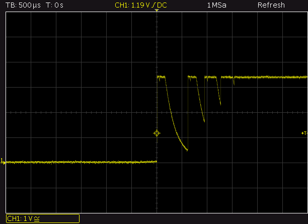

title: Tastenentprellung
parent: uebersicht.md

# Allgemeines
Die bekannteste Form von Schaltern und Tastern arbeitet elektromechanisch, indem zwei Kontakte je nach Zustand entweder
verbunden oder getrennt sind. Man spricht auch von den Zuständen *geschlossen* und *offen*.

Im mechanischen Aufbau des Tasters wird oft eine Feder benutzt, um die Kontakte zu trennen. Im *ungedrückten* Zustand
ist dieser Taster *offen*. Diese Konfiguration bezeichnet man als *Normally open* (kurz *NO*) Taster. Im gegensatz dazu
sind bei Tastern in der Konfiguration *Normally closed* (*NC*) die Kontakte per Feder *geschlossen* und erst durch
mechanische Betätigung werden die Kontakte getrennt.

Bedingt durch den Aufbau und der Feder wechselt bei einer Betätigung der Zustand nicht unmittelbar von *offen* zu
*geschlossen* (und umgekehrt) sondern es kommt zu einer mechanischen Schwingung, die diese Kontakte mehrfach aufeinander
prellen lässt. Daher die Bezeichnung *Tastenprellen* oder genauer *Kontaktprellen*.

Im folgenden Oszibild sieht man ein solches Prellen, welches in diesem Fall beim Loslassen der Taste aufgenommen wurde (0V entspricht *geschlossen*, 5V entspricht *offen*):



Im Bild sieht man das Prellen über eine Zeitdauer von ca. 1.5ms . Dies ist ein typischer Wert, kann aber je nach Bauart
auch stark variieren.

Das Problem beim Tastenprellen ist die Auswertung der Taste selbst. Zur Auswertung ob eine Taste gedrückt wurde wird
nach einer Flanke gesucht, sprich ein Zustandswechsel von *offen* zu *geschlossen* (oder umgekehrt). Je nach Implementierung
dieser Detektion kann durch das Prellen ein Tasterdruck mehrfach detektiert werden. Dies kann zu Problemen in der Anwendung führen.

# Entprellen
Es gibt verschiedene Möglichkeiten, einen Taster zu entprellen. Unterschieden wird zwischen Hardware- und Softwarelösungen.

Mögliche Hardwarelösungen stehen zur Verfügung:
* Nicht prellende Taster verwenden (meist relativ aufwendig und dadurch teuer)
* Tiefpassfilterung und Schmitttrigger
* Spezielle Entprellschaltungen oder ICs

Man kann auf Hardwarelösungen aber auch ganz verzichten, wenn die Entprellung in der Software durchgeführt wird.

Es gibt viele verschiedene Lösungen dies in Software zu realisieren. Hier werden drei Möglichkeiten gezeigt.

## Entprellen mittels Warten
Die einfachste Art das Prellen abzufangen ist nach der ersten Detektion einer Flanke einfach eine bestimmte Zeit zu warten.
Diese Zeit richtet sich nach der Dauer des Prellens der Taste.

Im folgenden Beispiel wird die Funktion `process_key` in der Main Loop aufgerufen. Die Durchlaufszeit einer Iteration der Main Loop sollte dabei kürzer als einige Millisekunden sein, damit auch kurze Tastendrücke detektiert werden können.

```c
uint8_t process_key(uint8_t key_state) {
  static uint8_t old_key_state=0; // old_key_state speichert den Zustand der vorhergehenden Iteration
  uint8_t result=0;               // Initialisere den Rückgabewert mit 0

  if (key_state!=old_key_state) { // Überprüfe Zustandsänderung
    if (key_state==1) {           // Wenn der neue Zustand "geschlossen" ist
      result=1;                   // gib 1 als Wert zurück
    }
    _delay_ms(5);                 // Warte 5 Millisekunden (blockierend!)
  }

  old_key_state=key_state;        // speichere den aktuellen Zustand für die nächste Iteration

  return result;
}
```

Diese Implementierung hat ein großes Problem: Die Wartezeit von 5 Millisekunden, die den Prozessor für diese Zeit blockiert.

Das Prinzip ließe sich übertragen auf eine Implementierung mit einem Timerinterrupt, der jede Millisekunde den Taster
auf eine Zustandsänderung überprüft und die Wartezeit mit mehreren Interruptaufrufen umsetzt.

## Vorfilterung
Wenn das Prellen selbst in der Software weggefiltert wird fällt die Detektierung der Flanke leichter und es entfällt damit
auch das Warten wie im vorherigen Beispiel.

Eine Vorfilterung lässt sich implementieren, indem man einen softwareinternen Zustand des Tasters realisiert, der erst
nach einer bestimmten Anzahl an Zuständen der gleichen Art umgestellt wird.

```c
#define MIN_ITERATION_COUNT 20

uint8_t process_key(uint8_t key_state) {
  static uint8_t internal_key_state=0; // softwareinterner Zustand
  static uint8_t count=0;              // Anzahl an Zuständen gleicher Art

  if (key_state!=internal_key_state) { // Wenn sich der interne Zustand vom externen unterscheidet
    count++;                           // Erhöhe den Zähler um eins
    if (count==MIN_ITERATION_COUNT) {  // bis die Mindestanzahl erreicht wurde
      internal_key_state=key_state;    // Stelle den internen Zustand um
      return key_state;                // Gib 1 zurück, wenn der neue Zustand 1 ist (ansonsten 0)
    }
  }
  else {
    count=0;                           // Wenn interner gleich externer Zustand ist setze Zähler auf 0
  }

  return 0;                            // Gib 0 für alle anderen Fälle zurück
}
```

## Nachbildung eines analogen Tiefpasses
Das was ein analoger Tiefpass bei der hardwaremäßigen Entprellung macht kann auch durch Software nachgebildet werden.

Dazu wird der Zustand des Tasters gemittelt. Wird ein bestimmter Schwellwert überschritten so wird der entsprechende
Zustand softwareintern gesetzt. Bei der Unterschreitung eines niedrigeren Schwellwertes wird der Zustand wieder zurückgesetzt.
