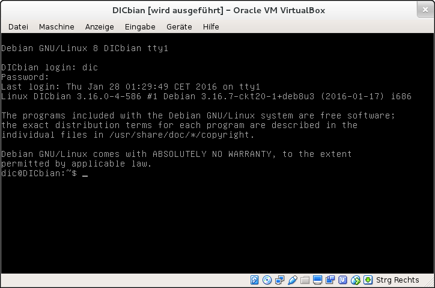

title: Tutorial 2 - Einstieg in die Shell
parent: uebersicht.md
next: tutorial3.md

.. info:: Unterlagen der Tuxcademy

    Dieses Tutorial baut auf den Unterlagen der [Tuxcademy](https://www.tuxcademy.org/) auf. Auch Aufgabenstellungen
    sind teilweise dort übernommen worden. Die Unterlagen stehen unter der [CC-BY-SA 4.0](https://creativecommons.org/licenses/by-sa/4.0/)
    Lizenz und somit auch dieses Tutorial.

    Eine Kopie der Unterlagen kann man [hier](grd1-de-manual.pdf) herunterladen.

# Allgemeines

.. info:: Definition durch Wikipedia - [Shell](https://de.wikipedia.org/wiki/Shell_\(Betriebssystem\))

    In der Informatik bezeichnet man als **Shell** die Software, die den Benutzer mit dem Computer verbindet. Die Shell
    ermöglicht zum Beispiel, Kerneldienste zu nutzen und sich über Systemkomponenten zu informieren oder sie zu bedienen.
    Der Begriff „Shell“ (englisch für „Hülle“ oder „Außenhaut“) stammt von Muschelschalen und beschreibt eine Oberfläche
    zwischen dem Anwender und dem Inneren (den Kernel-Komponenten).

    Bei Betriebssystemen gibt es zwei Arten von Shells, die Kommandozeile (englisch **C**ommand-**L**ine **I**nterface CLI)
    und die grafischen Benutzeroberflächen (englisch **G**raphical **U**ser **I**nterface GUI). Jedoch ist in der
    Umgangssprache meist der Kommandozeileninterpreter als Shell gemeint.

# Vorbereitung
Starte [DICbian](dicbian.html) und logge dich mittels dem Benutzernamen `dic` und dem Passwort `dic` ein.

# Übung

Arbeite dich durch die Kapitel 3 (Seite 39 bis 45), Kapitel 4 (Seite 47 bis 54) und Kapitel 6 (Seite 71 bis 98) und
beantworte die jeweiligen Übungen.

.. figure:: tutorial_uebung.png
    :title: Beispiel für eine Übung aus den Unterlagen
    :author:Tuxcademy
    :source: https://www.tuxcademy.org/
    :license: CC-BY-SA 4.0

## Editor
Ein einfacher Editor für Linux ist `nano`. Dieser ist auf den meisten Linux Systemen installiert und lässt sich leicht
über die Kombinationen mit <kbd>STRG</kbd> bedienen. Weiter Infos über `nano` gibt es [hier](https://wiki.ubuntuusers.de/Nano/).

Die wichtigsten Tastenkombinationen für `nano`:

* <kbd>STRG</kbd>+<kbd>o</kbd> bzw. <kbd>F3</kbd> - Datei speichern
* <kbd>STRG</kbd>+<kbd>x</kbd> bzw. <kbd>F2</kbd> - Datei schließen

.. figure:: tutorial_nano.png
    :title: Nano Editor im Einsatz
    :author: ubuntuusers.de
    :source: https://wiki.ubuntuusers.de/Nano/
    :license: CC BY-NC-SA 2.0 DE

## System herunterfahren
Wenn man DICbian in der Virtualbox herunterfahren möchte muss man sich erst als *Superuser* anmelden. Dies wird mittels
`su` gemacht (Passwort ist `htl`). Anschließend kann man mittels `poweroff` das System herunterfahren.

.. figure:: tutorial_poweroff.png
    :title: Herunterfahren von DICbian
