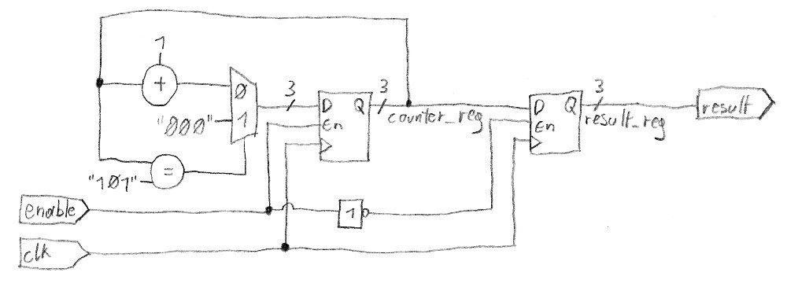

title: VHDL Test (2)
parent: uebersicht.md

# Allgemeines
* [Projektordner](vhdl_test_2.compress){: class="download" } herunterladen und entpacken
* Insgesamt gibt es 29 Punkte
* Die einzelnen Punkte bauen meist nicht aufeinander auf. Statt langer Fehlersuche lieber auf das nächste Beispiel wechseln.

# Einschaltverzögerung
## Vorbereitung
* Projekt <samp>led_delay/led_delay.xise</samp> öffnen

## Aufgabenstellung
Es ist eine einfache Einschaltverzögerung zu entwerfen. Diese Einschaltverzögerung steuert eine LED an und wird mittels zwei Tasten
bedient:

* <code>button_toggle</code> - Schaltet das Licht ein bzw. aus
* <code>button_on</code> - Schaltet das Licht in 3 Sekunden ein

## Entwurf der Zustandsmaschine
5 Punkte

Zur Realisierung wird eine Zustandsmaschine genutzt.

* Bearbeite die Datei <samp>led_delay_fsm.vhd</samp>
* Definiere die drei Zuständen <code>OFF</code>, <code>LIGHT</code> und <code>DELAY</code>
* Der Startzustand ist <code>OFF</code>
* Der Eingang <code>toggle_i</code> wechselt von <code>LIGHT</code> nach <code>OFF</code> bzw. von <code>OFF</code> oder <code>DELAY</code> nach <code>LIGHT</code>
* Der Eingang <code>on_i</code> wechselt von <code>OFF</code> nach <code>DELAY</code>, bei den anderen Zuständen hat er keine Auswirkung
* Der Eingang <code>timeout_i</code> bewirkt ein Wechsel von <code>DELAY</code> nach <code>LIGHT</code>, bei den anderen Zuständen hat er keine Auswirkung
* Der Ausgang <code>led_o</code> ist auf <code>'1'</code>, wenn die Zustandmaschine im Zustand <code>LIGHT</code> ist
* Der Ausgang <code>timer_enable_o</code> ist im Zustand <code>DELAY</code> auf <code>'1'</code>, ansonsten <code>'0'</code>
* Der Ausgang <code>timer_clear_o</code> ist im Zustand <code>OFF</code> auf <code>'1'</code>, ansonsten <code>'0'</code>

!!! panel-info "Testbench"
    Teste die Implementierung mittels der Testbench <samp>led_delay_fsm_tb.vhd</samp>. Mittels <kbd>F6</kbd> lässt sich
    der gesamte Bereich zoomen.

## Implementierung des Top Levels
5 Punkte

Zur Verfügung stehen die Komponenten <samp>counter</samp>, <samp>button_dectect</samp> und <samp>led_delay_fsm</samp>. Diese
Komponenten werden genutzt, um im Top Level <samp>led_delay.vhd</samp> die gewünschte Funktionalität zu realisieren.

* Die Instanz der Komponente <samp>button_detect</samp> mit dem Namen <code>toggle_detect_component</code> ist bereits erstellt
    * <code>button_i</code> ist mit dem Eingang <code>button_toggle_i</code> verbunden
    * <code>detect_o</code> ist mit dem (bereits definiertem) Signal <code>toggle_detect</code> verbunden
* Erstelle eine Instanz der Komponente <samp>button_detect</samp> mit dem Namen <code>on_detect_component</code> analog zu <code>toggle_detect_component</code>
    * <code>button_i</code> ist mit dem Eingang <code>button_on_i</code> verbunden
    * <code>detect_o</code> ist mit dem (bereits definiertem) Signal <code>on_detect</code> verbunden
* Erstelle eine Instanz der Komponente <samp>led_delay_fsm</samp> mit dem Namen <code>led_delay_fsm_component</code>
    * <code>toggle_i</code> ist mit dem Signal <code>toggle_detect</code> verbunden
    * <code>on_i</code> ist mit dem Signal <code>on_detect</code> verbunden
    * <code>timeout_i</code> ist mit dem (bereits definiertem) Signal <code>timeout</code> verbunden
    * <code>led_o</code> ist mit dem Ausgang <code>led_o</code> verbunden
    * <code>timer_enable_o</code> ist mit dem (bereits definiertem) Signal <code>timer_enable</code> verbunden
    * <code>timer_clear_o</code> ist mit dem (bereits definiertem) Signal <code>timer_clear</code> verbunden
* Erstelle eine Instanz der Komponente <samp>counter</samp> mit dem Namen <code>timeout_component</code>
    * <code>WIDTH</code> in der *generic map* wird auf 28 gestellt (28 Bit)
    * <code>MAXIMUM</code> wird auf <code>CLK_TIMEOUT_DIVIDER</code> gestellt (ist im *generic* Teil des Top Levels bereits definiert)
    * <code>enable_i</code> ist mit dem Signal <code>timer_enable</code> verbunden
    * <code>reset_i</code> ist mit dem Signal <code>timer_clear</code> verbunden
    * <code>value_o</code> ist nicht verbunden (<code>open</code>)
    * <code>overflow_o</code> ist mit dem Signal <code>timeout</code> verbunden
* Jede Komponente hat einen Takteingang <code>clk</code>, welcher mit dem globalen <code>clk</code> verbunden wird

!!! panel-info "Testbench"
    Teste die Implementierung mittels der Testbench <samp>led_delay_tb.vhd</samp>.

## Erweiterung der *Constraints* Datei
2 Punkte

In der Datei <samp>led_delay.ucf</samp> ist nur das Signal <code>clk</code> definiert. Erweitere die Datei um folgende Zuordnungen

* <code>button_toggle_i</code> wird durch den Taster <samp>BTN0</samp> angesteuert
* <code>button_on_i</code> wird durch den Taster <samp>BTN1</samp> angesteuert
* <code>led_o</code> ist die LED <samp>LD0</samp>

<figure><figcaption>Pinout des BASYS2 Boards(Bild: <a href="http://www.digilentinc.com/Products/Detail.cfm?NavPath=2,400,790&Prod=BASYS2">Digilent Inc. BASYS2 Manual</a>)</figcaption></figure>

## Test am Board
1 Punkt

Synthetisiere das Projekt und teste das Ergebnis am Board

# Würfel
## Vorbereitung
* Projekt <samp>dice/dice.xise</samp> öffnen

## Aufgabenstellung
Mittels sieben LEDs wird ein Würfel dargestellt. Eine Taste startet durch das Drücken einen *Zufallsgenerator* und beim
Loslassen wird das Ergebnis angezeigt. Dieser *Zufallsgenerator* ist ein Zähler, der mit 50Mhz die 6 möglichen Zustände
durchwechselt.

## Decoder testen
5 Punkte

Der Decoder wandelt den Eingang <code>value_i</code> (3 Bit) in die entsprechende 7 LEDs Darstellung <code>leds_o</code> (7 Bit) um. Dabei
wird folgende kodierung verwendet:

LED6|LED5|LED4|LED3|LED2|LED1|LED0
:---:|:---:|:---:|:---:|:---:|:---:|:---:
Aus|Aus|Aus|**Ein**|Aus|Aus|Aus
Aus|Aus|**Ein**|Aus|**Ein**|Aus|Aus
Aus|**Ein**|Aus|**Ein**|Aus|**Ein**|Aus
**Ein**|Aus|**Ein**|Aus|**Ein**|Aus|**Ein**
**Ein**|**Ein**|Aus|**Ein**|Aus|**Ein**|**Ein**
**Ein**|**Ein**|**Ein**|Aus|**Ein**|**Ein**|**Ein**

* Die erste Zeile entspricht der Darstellung bei <code>value_i</code> gleich <code>"000"</code>
* *Ein* wird mittels <code>'1'</code> kodiert, *Aus* mittels <code>'0'</code>
* Bei nicht definierten Zustände sollen alle LEDs aus sein

Die Komponente ist in vier Ausführungen (*Architectures*) bereits in der Datei <samp>decoder.vhd</samp> beschrieben. Die
*Architectures* lauten <code>behave1</code>, <code>behave2</code>, <code>behave3</code> und <code>behave4</code>.

Erstelle in der Datei <samp>decoder_tb.vhd</samp> eine Testbench, die herausfindet, welche der vier Ausführungen
funktioniert (es ist genau eine).

## Komponente <code>shuffle</code>
5 Punkte

Erstelle die Komponente <code>shuffle</code> durch Bearbeitung der Datei <samp>shuffle.vhd</samp> nach folgender Skizze:

* Wenn <code>enable_i</code> auf <code>'1'</code> ist, soll der interne Zähler <code>counter_reg</code> bei einer steigenden Taktflanke hinaufzählen
* Der interne Zähler soll von 0 bis 5 zählen
* Das Register <code>result_reg</code> übernimmt bei einer steigenden Taktflanke den Wert von <code>counter_reg</code>, wenn <code>enable_i</code> gleich <code>'0'</code> ist

!!! panel-info "Testbench"
    Teste die Implementierung mittels der Testbench <samp>shuffle_tb.vhd</samp>.

## Implementierung des Top Levels
5 Punkte

Zur Verfügung stehen die Komponenten <samp>shuffle</samp>, <samp>decoder</samp>. Diese
Komponenten werden genutzt, um im Top Level <samp>dice.vhd</samp> die gewünschte Funktionalität zu realisieren.

!!! panel-info "Testbench"
    Teste die Implementierung mittels der Testbench <samp>dice_tb.vhd</samp>.

## Test am Board
1 Punkt

Synthetisiere das Projekt und teste das Ergebnis am Board
