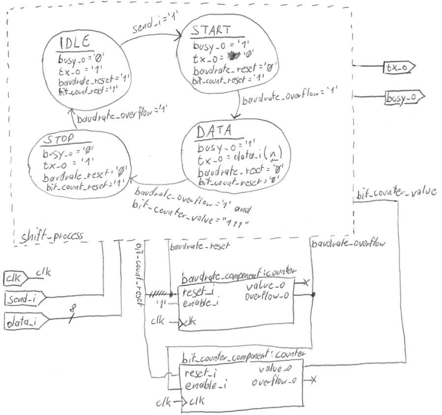
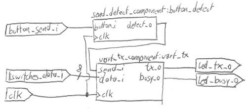

title: VHDL Test (4)
parent: uebersicht.md

# Allgemeines
* [Projektordner](vhdl_test_4.zip) herunterladen und entpacken
* Insgesamt gibt es 20 Punkte
* Die einzelnen Punkte bauen meist nicht aufeinander auf. Statt langer Fehlersuche lieber auf das nächste Beispiel wechseln.

# Serielle Datenübertragung
## Vorbereitung
* Projekt <samp>transmitter.xise</samp> öffnen

## Aufgabenstellung
Um Daten zu Übertragen wird oft die serielle Schnittstelle verwendet. In diesem Beispiel soll ein Transmitter entsprechend
RS232 realisiert werden.

.. figure:: ../../bussysteme/rs232_timing.png
    :title: RS232 Timingdiagramm
    :author: Gerald.deppe
    :source: https://commons.wikimedia.org/wiki/File:RS-232_timing.png
    :license: Public Domain

Zum Testen soll mittels der acht Umschaltern (<samp>SW0</samp> bis <samp>SW7</samp>) ein 8 Bit Datenwort definiert werden und
durch Drücken des Tasters <samp>BTN0</samp> wird dieses dann *versendet*. Zum Versenden wird der Pegel der Sendeleitung
mittels LED angezeigt. Die Baudrate wird auf 1 Baud gestellt.

## <samp>uart_tx</samp> Komponente

### Zustandsmaschine
10 Punkte

* Die erforderliche Zustandsmaschine hat die Zustände `IDLE`, `START`, `DATA` und `STOP`
* Eingänge:
    * `send_i` - startet die Übertragung
    * Überlauf den Baudraten Generators - wechselt bei einer laufenden Übertragung zum nächsten Symbol
* Ausgänge:
    * `tx_o` - das zu sendende Bit (bzw. Symbol)
    * `busy_o` - zeigt eine laufende Übertragung an (`'1'` wenn eine Übertragung läuft)
* Wenn die Zustandsmaschine im Zustand `IDLE` ist und `send_i` gleich `'1'` ist, dann wird in den Zustand `START` gewechselt.
* Vom Zustand `START` wird in den Zustand `DATA` gewechselt, sobald der Zähler für die Baudrate übergelaufen ist
* Im Zustand `DATA` läuft ein Bit Zähler und zählt die Bits von 0 bis 7 (LSB zuerst)
* Jedes Bit wird für die Dauer ausgegeben, die sich aus der Baudrate ergibt
* Nach dem 8. Datenbit wird in den Zustand `STOP` gewechselt
* Vom Zustand `STOP` wird in den Zustand `IDLE` gewechselt, sobald der Zähler für die Baudrate übergelaufen ist
* Ausgabe von `tx_o`
    * Ist in `IDLE` und `STOP` auf `'1'`
    * Ist in `START` auf `'0'`
    * Entspricht während `DATA` dem zu übertragenden Datenbit

### Baudratengenerierung
2 Punkte

Für die Baudratengenerierung wird der bestehende Zähler (<samp>counter</samp>) verwendet. Die Entity enthält die beiden
Generics <samp>BAUDRATE_WIDTH</samp> und <samp>BAUDRATE_DIVIDER</samp>, die den Zähler konfigurieren.

### Bit Zähler
2 Punkte

Um die einzelnen Datenbits zu zählen (während des Zustands `DATA`) wird eine weitere Zählerinstanz verwendet. Diese
Zählerinstanz zählt von 0 bis 7.

Der Ausgang `value_o` des Bit Zählers ist vom Typ <samp>std_ulogic_vector</samp>. Dieser muss zuerst in einen <samp>unsigned</samp>
und dann mittels <samp>to_integer</samp> in einen Integer gewandelt werden, um mittels Indexzugriff das gewünschte Bit aus
dem `data_i` Vektor zu holen (z.B. `data_i(0)` holt Bit 0 des Vektors).

### Blockschaltbild
Dieses Blockschaltbild zeigt die einzelnen Komponenten der <samp>uart_tx</samp> Komponente. Die resultierende VHDL
Beschreibung sollte äquvivalent zu diesem Blockschaltbild sein.

.. info:: Testbench

    Teste die Implementierung mittels der Testbench <samp>uart_tx_tb.vhd</samp>.

## Implementierung des Top Levels
3 Punkte

Zur Verfügung stehen die Komponenten <samp>button_dectect</samp> und <samp>uart_tx</samp>. Diese
Komponenten werden genutzt, um im Top Level <samp>transmitter.vhd</samp> die gewünschte Funktionalität zu realisieren.

Einige benötigte Signale sind bereits vordefiniert.

Erstelle das Top Level anhand des folgenden Blockschaltbildes:

.. info:: Testbench

    Teste die Implementierung mittels der Testbench <samp>transmitter_tb.vhd</samp>.

## Erweiterung der *Constraints* Datei
2 Punkte

In der Datei <samp>transmitter.ucf</samp> ist nur das Signal `clk` definiert. Erweitere die Datei um folgende Zuordnungen

* `button_send_i` liegt an Pin `G12`
* `switches_data_i(0)` liegt an Pin `P11`
* `switches_data_i(1)` liegt an Pin `L3`
* `switches_data_i(2)` liegt an Pin `K3`
* `switches_data_i(3)` liegt an Pin `B4`
* `switches_data_i(4)` liegt an Pin `G3`
* `switches_data_i(5)` liegt an Pin `F3`
* `switches_data_i(6)` liegt an Pin `E2`
* `switches_data_i(7)` liegt an Pin `N3`
* `led_tx_o` liegt an Pin `M5`
* `led_busy_o` liegt an Pin `M11`

.. figure:: ../basys2_pinout.svg
    :title: Pinout des BASYS2 Boards
    :author: Digilent Inc. BASYS2 Manual
    :source: https://digilent.com/shop/about-fpga-boards/
    :license: &copy; Digilent

## Test am Board
1 Punkt

Synthetisiere das Projekt und teste das Ergebnis am Board
