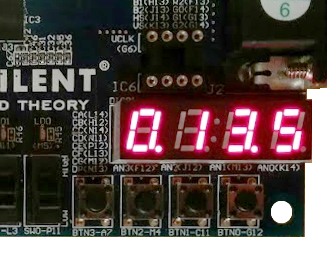
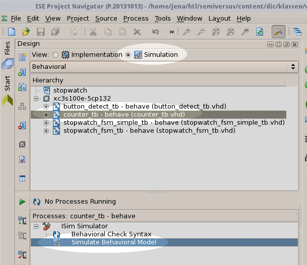
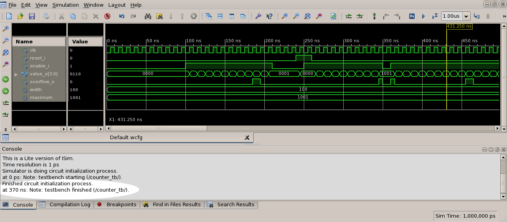

title: VHDL Übung 5 - Stoppuhr
next: uebung6.md
parent: uebersicht.md

# Übungsaufgabe

.. info:: In dieser Übung wird das BASYS2 Board verwendet

    Für weitere Fragen zum Board bitte das [Manual](basys2_manual.pdf) konsultieren.

* Entwurf einer universeller Zählerkomponente
* Erkennung eines Tastendrucks
* Implementierung einer Zustandsmaschine
* Aufbau eines Top Levels

Die Stoppuhr entspricht in ihrer Bedienung einer klassichen digitalen Stoppuhr. Zwei Tasten reichen für die Bedienung
aus:

* **Start/Stop** - die Zeitnehmung wird gestartet bzw. gestopped
* **Reset/Lap** - die Zeitnehmung wird zurückgesetzt bzw. die Zwischenzeit angezeigt

Die vier 7-Segment Anzeigen werden für die Ausgabe der Zeit verwendet (hier 0 Minuten, 13 Sekunden und 5
Zehntelsekunden):



# Vorbereitung

* [Projektordner](vhdl_uebung_5.zip) herunterladen und entpacken
* Projekt `stopwatch.xise` öffnen

# Entwicklung einer universellen Zählerkomponente
## Spezifikation
Der Zähler soll folgende Spezifikation erfüllen (immer synchron zur steigenden Taktflanke von `clk`):

* Wenn `enable_i` auf `0` ist soll der Zähler nicht zählen
* Wenn `enable_i` auf `1` ist soll der Zähler sich um eins erhöhen
* Wenn der Zählerstand `MAXIMUM` erreicht soll der Zähler (im nächsten Schritt) auf 0 gesetzt werden
* Solange `reset_i` auf `1` ist, soll der Zählerstand auf 0 gesetzt werden
* Ein gesetzes `reset_i` hat eine höhere Priorität als ein gesetzes `enable_i`
* `value_o` entspricht dem internen Zählerstand
* `overflow_o` ist `1`, wenn der interne Zählerstand bei `MAXIMUM` steht und `enable_i` auf `1` ist (kombinatorisch
verknüpft)

## Implementierung
* Öffne `counter.vhd`
* Erweitere das Design entsprechend der folgenden Spezifikation (an den mit `TODO` markierte Stellen)

## Test mittels Testbench

* Wechsle im Design Tab bei *View* nach *Simulation*
* Wähle die Testbench `counter_tb` (Datei `counter_tb.vhd`)
* Starte die Simulation mittels *Simulate Behavioral Model*



Beim Durchlaufen der Testbench werden etwaige Fehler des Design angezeigt. Eine erfolgreiche Testbench endet ohne
Fehlerausgaben:



# Tastendruck Erkennung
## Spezifikation
Tasteneingänge sind asynchron zum globalen Takt, deswegen müssen sie einsynchronisiert werden. Nachdem der Eingang
synchronisiert ist benötigt man im Allgemeinen eine synchrone Flankenerkennung, d.h. bei einer steigenden Flanke soll
der Ausgang `detect_o` für einen Taktzyklus lang auf `1` sein. Eine fallende Flanke soll ignoriert werden.

## Timingdiagramm


## Implementierung
Bearbeite dazu die Datei `button_detect.vhd`. Die beiden Register `button_reg1` und `button_reg2` dienen der
Einsynchronisierung des asynchronen Signals von `button_i`.

## Test mittels Testbench

* Wechsle im Design Tab bei *View* nach *Simulation*
* Wähle die Testbench `button_detec_tb` (Datei `button_detect_tb.vhd`)
* Starte die Simulation mittels *Simulate Behavioral Model*

Beim Durchlaufen der Testbench werden etwaige Fehler des Design angezeigt. Eine erfolgreiche Testbench endet ohne
Fehlerausgaben (siehe [Test des universellen Zählers](#test-mittels-testbench)).

# Zustandsmaschine für die Stoppuhr
## Spezifikation

Die Zustandsmaschine für die Stoppuhr soll im ersten Schritt drei Zustände umfassen:

* `CLEARED`
    * Zeit läuft nicht
    * Stoppuhr steht auf "0:00:0"
    * Mittels *Start/Stopp* soll die Zeitnehmung starten
    * *Reset/Lap* hat keine Auswirkung
* `RUNNING`
    * Zeit läuft
    * Zeigt die aktuelle Zeit an
    * Mittels *Start/Stopp* soll die Zeitnehmung gestoppt werden
    * *Reset/Lap* hat keine Auswirkung
* `STOPPED`
    * Stoppuhr läuft nicht
    * Zeigt die (gestoppte) Zeit an
    * Mittels *Start/Stopp* soll die Zeitnehmung fortgesetzt werden
    * Mittels *Reset/Lap* soll die Zeit auf "0:00:0" zurückgesetzt werden

Die Zustandmaschine hat zwei Eingaben (Taster *Start/Stopp* und *Reset/Lap*). Die Ausgabe `clear_o` setzt die Zähler
zurück. Solange `enable_o` auf `'1'` ist laufen die Zähler.

## Zustandsdiagramm
Zeichne das Zustandsdiagramm. Wähle einen passenden Zustandsmaschinentyp aus
([Mealy oder Moore](../grundlagen_der_digitaltechnik/automatentheorie.html#moore-und-mealy-automat_1)).

## Implementierung
Vervollständige die Vorlage von `stopwatch_fsm`. Dort sind die Zustände `CLEARED`, `RUNNING` und `STOPPED` als Typ
definiert. Die Behandlung des Zustands `CLEARED` und die Ausgabe von `clear_o` ist als Beispiel bereits implementiert.

Der Ausgang `mode_o` wird erst später benötigt und soll vorerst nur `'0'` ausgeben.

```vhdl
architecture behave of stopwatch_fsm is
  type state_t is (CLEARED, RUNNING, STOPPED);
  signal state : state_t := CLEARED;
begin
  fsm_process: process (clk)
  begin
    if rising_edge(clk) then
      case state is
        when CLEARED =>
          if ss_i='1' then
            state <= RUNNING;
          end if;
        when RUNNING =>
          -- TODO
        when others => -- includes STOPPED
          -- TODO
      end case;
    end if;
  end process;

  clear_o <= '1' when state=CLEARED else '0';
  enable_o <= '0'; -- <<< TODO
  mode_o <= '0';
end architecture;
```

## Test mittels Testbench
Teste die Zustandmaschine  mittels der Testbench `stopwatch_fsm_simple_tb` (Achte auf das `simple` im Name!).

# Integration aller Komponenten im Top Level
Mit den erstellten Komponenten wird nun ein Stoppuhr-Design aufgebaut. Dazu erweitern wird das Top Level Design in
`stopwatch.vhd`.

## Tastendruckerkennung

Die Komponente `button_dect` wird verwendet, um das Signal `button_ss_i` und `button_rl_i` einzusynchronisieren und auf
eine steigende Flanke zu überprüfen. Dazu wird folgende Komponente in der `architecture` von `stopwatch.vhd` hinzugefügt:

```vhdl
button_ss_detect_component: entity work.button_detect
port map (
  clk => clk,
  button_i => button_ss_i,
  detect_o => button_ss_detect
);
```

Analoges Vorgehen für die Taste `button_rl_i`.

## Zustandsmaschine

Die Zustandmaschine wird nun auch entsprechend eingebunden.

* Erstelle eine Instanz von `stopwatch_fsm` mit dem Namen `stopwatch_fsm_component`
* Verbinde den Eingang `clk` mit dem Signal `clk`
* Verbinde den Eingang `ss_i` mit dem Signal `button_ss_detect`
* Verbinde den Eingang `rl_i` mit dem Signal `button_rl_detect`
* Verbinde den Ausgang `mode_o` mit nichts (`open`)
* Verbinde den Ausgang `clear_o` mit dem Signal `clear`
* Verbinde den Ausgang `enable_o` mit dem Signal `enable`

## Vorteiler

Um Zehntelsekunden zu erzeugen wird ein Vorteiler mit dem Faktor 5 Millionen verwendet.

```vhdl
prescale_component: entity work.counter
generic map (
  WIDTH => 23,
  MAXIMUM => 5000000
)
port map (
  clk => clk,
  reset_i => clear,
  enable_i => enable,
  value_o => open,
  overflow_o => tenth_second_enable
);
```

* Diese `counter` wird über das `generic map` als Zähler mit 23 Bit und Maximum bei 5 Millionen definiert
* Der Ausgang `value_o` wird nicht verwendet (wird durch `open` signalisiert)
* `overflow_o` steuert das Signal `tenth_second_enable` an (ist nun alle 5 Millionen Takte für einen Takt high)
* `enable_i` wird durch `enable` angesteuert (Ausgang der Zustandsmaschine)
* `reset_i` wird durch `clear` angesteuert (Ausgang der Zustandsmaschine)

## Zehntelsekunde
* Erstelle eine weitere Instanz eines Zählers(`tenth_second_component`) analog zu `prescale_component`
* `WIDTH` und `MAXIMUM` müssen nicht extra definiert werden (`generic map` kann wegfallen), da diese Werte der
  Standardeinstellung entsprechen
* `enable_i` wird durch `tenth_second_enable` angesteuert
* `reset_i` wird durch `clear` angesteuert
* `value_o` steuert `digit0` an
* `overflow_o` steuert `second_enable` an

## Sekunde
* Erstelle eine weitere Instanz eines Zählers(`second_component`) analog zu `tenth_second_component`
* `enable_i` wird durch `second_enable` angesteuert
* `value_o` steuert `digit1` an
* `overflow_o` steuert `ten_second_enable` an

## Zehner Sekunde
* Erstelle eine weitere Instanz eines Zählers(`ten_second_component`) analog zu `tenth_second_component`
* `MAXIMUM` wird auf 5 gestellt (Sekunden gehen bis 59) - dazu wird die `generic map` genutzt
* `enable_i` wird durch `ten_second_enable` angesteuert
* `value_o` steuert `digit2` an
* `overflow_o` steuert `minute_enable` an

## Minute
* Erstelle eine weitere Instanz eines Zählers(`minute_component`) analog zu `tenth_second_component`
* `enable_i` wird durch `minute_enable` angesteuert
* `value_o` steuert `digit3` an
* `overflow_o` wird nicht verwendet (mit `open` verbunden)

## `display` hinzufügen

```vhdl
display_component: entity work.display
port map (
  clk => clk,
  digit0_i => digit0,
  digit1_i => digit1,
  digit2_i => digit2,
  digit3_i => digit3,
  dots_i => "1010",
  segments_o => segments_o,
  an_o => an_o
);
```

## Test auf der Hardware
Wechsle in die Implementierungsansicht und synthetisiere das Top Level Desgin `stopwatch`. Teste die Funktionsweise
auf dem Basys2 Board aus.

# Erweiterung um Zwischenzeitnehmung
## Spezifikation
Im letzen Schritt gibt es eine Erweiterung des bestehenden Designs: Die Zwischenzeitnehmung.

* Im Zustand `RUNNING` wird durch Drücken von *Reset/Lap* in den Zustand `LAP` gwechselt werden
* In `LAP` wird nicht die aktuelle Zeit angezeigt, sondern eine *zwischengespeicherter* Zeit
* Im Zustand `LAP` wird durch Drücken von *Reset/Lap* wieder zurück in den Zustand `RUNNING` gewechselt werden
* Im Zustand `LAP` wird durch Drücken von *Start/Stopp* in den Zustand `LAP_STOPPED` gewechselt werden
* Im Zustand `LAP_STOPPED` läuft die Zeit nicht weiter, es wird weiterhin die *zwischengespeicherte* Zeit angezeigt
* Im Zustand `LAP_STOPPED` wird durch Drücken von *Reset/Lap* in den Zustand *STOPPED* gewechselt

## Implementierung
Die Eingänge `digit0` bis `digit3` der `display_component` werden nun nicht mehr über die Zähler angesteuert sondern mittels
Register (`digit0_reg`, ... ist bereits definiert). Dieses Register soll die Eingänge `digit0`, ... übernehmen, wenn
das Signal `mode` auf `'1'` ist (Ausgang der Zustandsmaschine). Füge dazu einen `process` im Top Level ein.

Erweitere die Zustandsmaschine um die zusätzlichen Zustände und steuere `mode_o` entsprechend der Spezifikation an.

## Test mittels Testbench
Für die überarbeitete Zustandsmaschine steht eine Testbench bereit (`stopwatch_fsm_tb`).

## Test auf der Hardware
Wechsle in die Implementierungsansicht und synthetisiere das Top Level Desgin `stopwatch`. Teste die Funktionsweise
auf dem Basys2 Board aus.
