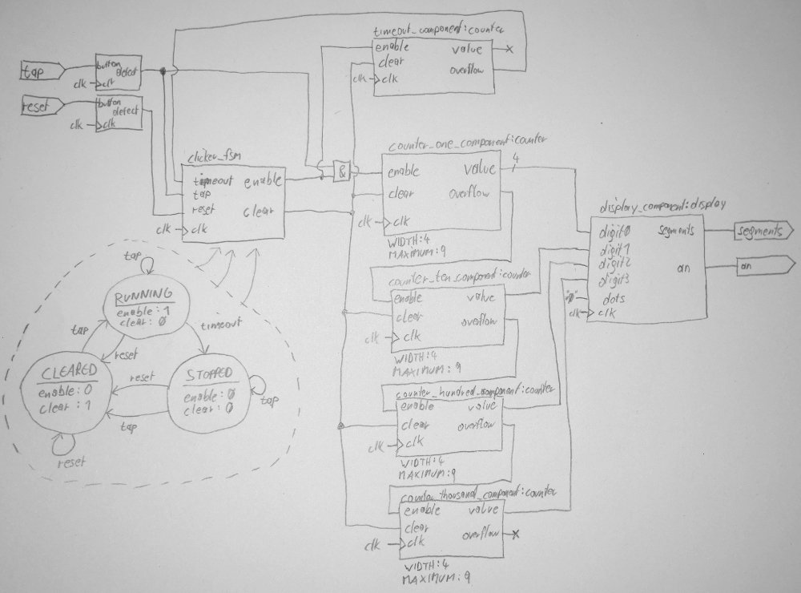

title: VHDL Übung 6 - Clicker
next: uebung7.md
parent: uebersicht.md

# Übungsaufgabe

!!! panel-info "In dieser Übung wird das BASYS2 Board verwendet"
    Für weitere Fragen zum Board bitte das [Manual](basys2_manual.pdf){: class="download" } konsultieren.

* Definition einer Zustandmaschine
* Integration der Komponenten im Top Level

# Vorbereitung

* [Projektordner](vhdl_uebung_6.compress){: class="download" } herunterladen und entpacken
* Projekt <code>clicker.xise</code> öffnen

# Aufbau des Top Levels
## Spezifikation
Im ersten Schritt soll ein Design erstellt werden, das über zwei Tasten angesteuert wird:

* <code>tap</code> - Mit dieser Taste wird das Spiel gestartet und während des Spiels werden die Tastendrücke gezählt
* <code>reset</code> - Diese Taste führt zum Spielanfang

Das Spiel kennt drei Zustände:

* <code>CLEARED</code> - Der initiale Zustand, alle Zähler werden gelöscht. Der Tastendruck von <code>reset</code> führt immer hierher.
* <code>RUNNING</code> - Das Spiel läuft für 60 Sekunden. Die Anzahl der Tastendrücke von <code>tap</code> wird mitgezählt.
* <code>STOPPED</code> - Nach den 60 Sekunden werden die Zähler angehalten (und somit das Ergebnis angezeigt)

Für dieses Spiel lassen sich viele Komponenten von [Übung 5 (Stoppuhr)](uebung5.html) wiederverwenden.

## Implementierung
Im folgenden Bild ist die gesamte Schalung und das Zustandsdiagramm zu sehen. Das Ziel ist eine Implementierung im Top
Level. Orientierung bietet [Übung 5](uebung5.html).

