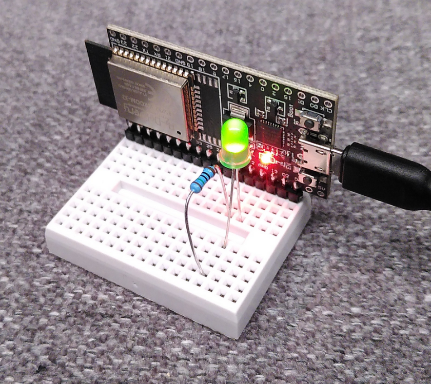

title: Installation ESP32
parent: ../../unterricht.md

# Installation der Arduino IDE

Über die offizielle [Arduino](https://www.arduino.cc/en/software/) Seite die IDE herunterladen und installieren.


## ESP32 Board Support

Mittels "File" → "Preferences" wird über "Additional Board Manager URLs" folgende URL hinzugefügt:

    https://raw.githubusercontent.com/espressif/arduino-esp32/gh-pages/package_esp32_index.json


## ESP32 Board auswählen

Mittels "Tools" → "Board: *...*" wird folgendes ESP32 Board ausgewählt: "ESP32 Dev Module"

## Erstes Beispiel

```c
#define LED_GPIO 12

void setup() {
  pinMode(LED_GPIO, OUTPUT);
}

void loop() {
  digitalWrite(LED_GPIO, HIGH);
  delay(300);
  digitalWrite(LED_GPIO, LOW);
  delay(300);
  while(1);
}
```

Auf dem Steckbrett werden folgende Verbindungen gemacht:

* **Pin 12** über Vorwiderstand zur Anode der LED
* **Pin GND** zur Kathode der LED (abgeflacht Seite)



## USB Treiber

Es kann je nach Windows Version notwendig sein, einen USB RS232 Treiber zu installieren. Dieser kann hier heruntergeladen werden: [Silicon Labs CP210x](https://www.silabs.com/developers/usb-to-uart-bridge-vcp-drivers)

## Kompilieren und Upload

Mittels "Sketch" → "Verify/Compile" wird das Projekt compiliert. Anschließend mittels "Sketch" → "Upload" (oder mittels <kbd>Strg+U</kbd>).