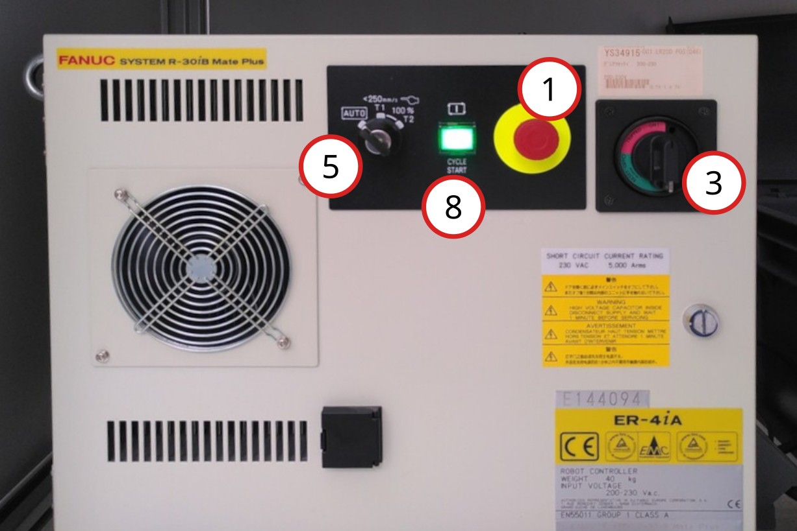
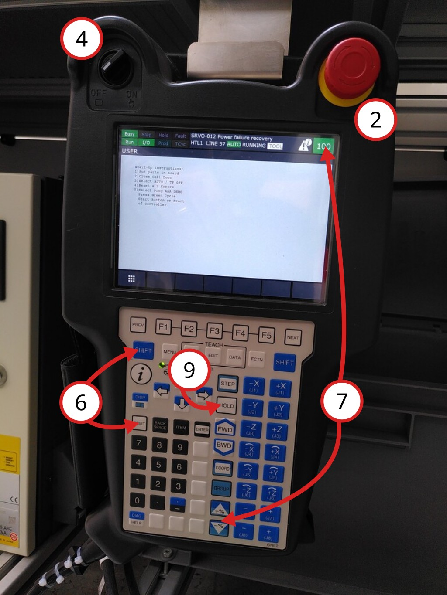
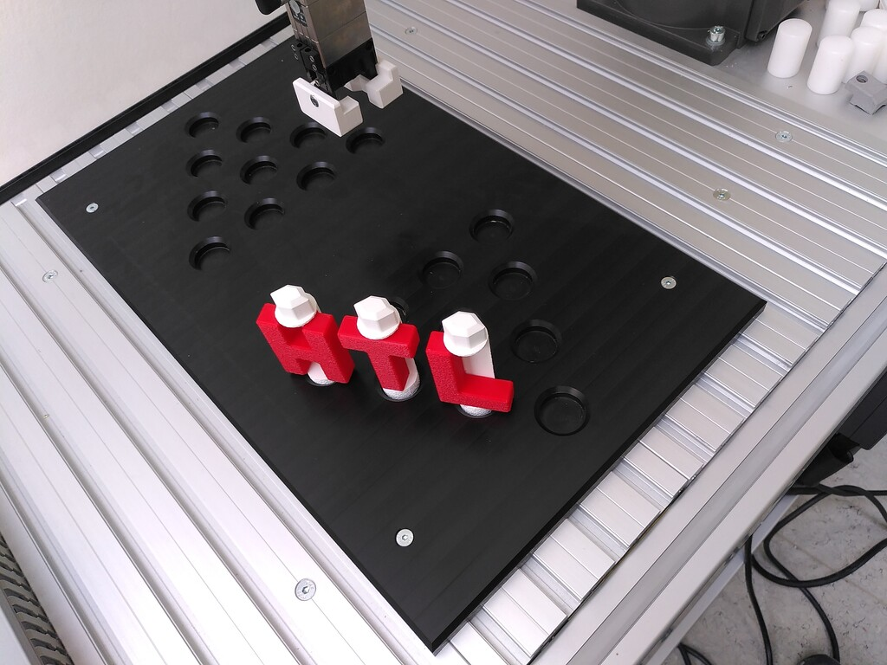

# Inbetriebnahme FANUC Demo

Checklist vor der Inbetriebnahme:
* Aufstellen der Buchstaben entsprechend des Fotos
* Tür geschlossen
* Notaus entriegelt (einmal am Controller **(1)**, einmal am Handteil **(2)**)
* Einschalten des Controllers **(3)**
* Handteil links oben auf `Off` **(4)** (für automatische Ausführung)
* Controller auf `AUTO` stellen **(5)**
* Mögliche Fehler löschen mittels `SHIFT` + `RESET` **(6)**
* Geschwindigkeit auf 100% stellen **(7)**

## Start
* Druck auf "Start" am Controller **(8)**

## Stop
* Warten bis der Roboter den Zyklus beendet hat und in der 5 Sekunden Pause ist
* Drück am Handteil auf `HOLD` **(9)**