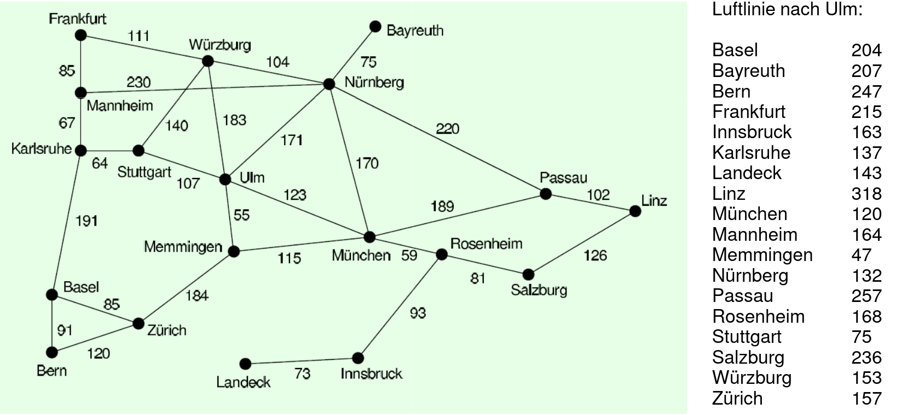

title: Beispiele Graphentheorie
parent: uebersicht.md

# Huffman Kodierung

* [Beispiel 2 aus Test 2](test2.pdf)

# Breiten / Tiefensuche 1

# Breiten/Tiefensuche 2

# Branch and Bound 1

# Branch and Bound 2

# Hanoi

# n-Puzzle

# Hill Climb / Beam

# A* 1

# A* 2

* [Beispiel 2 aus Test1](test1.pdf)

# A* mit n-Puzzle

# Online

[Visualisierung](https://qiao.github.io/PathFinding.js/visual/)

# Min-Max

# Alpha-Beta