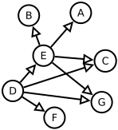
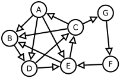

title: Graphentheorie
parent: uebersicht.md
next: huffman.md

# Allgemeines

Die *Graphentheorie* ist ein Teilgebiet der Mathematik und Informatik, das sich mit der Untersuchung von Graphen beschäftigt. Ein Graph besteht aus einer Menge von *Knoten* und einer Menge von *Kanten*, die Paare von Knoten verbinden. Graphen dienen als abstrakte Modelle für netzartige Strukturen in Natur und Technik, wie beispielsweise soziale Netzwerke, Verkehrsnetze oder Kommunikationssysteme.

- **Knoten**: Die grundlegenden Elemente eines Graphen, die Objekte oder Zustände repräsentieren.
- **Kanten**: Verbindungen zwischen Knoten, die Beziehungen oder Übergänge darstellen.
- **Pfad**: Eine endliche Folge von Knoten, bei der jeder aufeinanderfolgende Knoten durch eine Kante verbunden ist
- **Gewicht**: Reele Zahl die einer Kante (manchmal auch Knoten) zugeordnet wird

# Historisches Beispiel: Das Königsberger Brückenproblem

.. figure:: bridges.png
    :title: Königsberg
    :author: Bogdan Giuşcă
    :source: https://commons.wikimedia.org/wiki/File:Konigsberg_bridges.png
    :license: Public Domain

Ein klassisches Problem der Graphentheorie ist das **Königsberger Brückenproblem**. In der Stadt Königsberg gab es sieben Brücken, die verschiedene Landteile verbanden. Die Frage lautete, ob es einen Rundweg gibt, der jede Brücke genau einmal überquert.

Leonhard Euler bewies 1736, dass ein solcher Weg nicht existiert, da mehr als zwei Landteile eine ungerade Anzahl von Brücken aufwiesen. Dieses Problem gilt als Geburtsstunde der Graphentheorie.

# Arten von Graphen

- **Ungerichtete Graphen**: Die Kanten haben keine Richtung; die Verbindung zwischen zwei Knoten ist bidirektional.
- **Gerichtete Graphen (Digraphen)**: Die Kanten haben eine Richtung, dargestellt durch Pfeile, was eine gerichtete Beziehung zwischen Knoten anzeigt.
- **Gewichtete Graphen**: Kanten sind mit Gewichten versehen, die beispielsweise Entfernungen, Kosten oder Kapazitäten repräsentieren.
- **Planare Graphen**: Graphen, die in der Ebene so gezeichnet werden können, dass sich keine Kanten schneiden.
- **Zyklen**: Ein Pfad, der zum Ausgangsknoten zurückführt, bildet einen Zyklus.
- **Bäume**: Zusammenhängende, azyklische Graphen, die eine hierarchische Struktur darstellen.

Beispiel für einen Graph mit Zyklen:

# Bäume

Ein **Baum** ist ein spezieller Typ eines Graphen, der zusammenhängend und **azyklisch** ist, also keine geschlossenen Pfade (Zyklen) enthält. Bäume spielen eine zentrale Rolle in der Informatik und Mathematik, da sie hierarchische Strukturen modellieren.

## Eigenschaften eines Baumes
- **Wurzel**: Der oberste Knoten des Baums, von dem alle anderen Knoten ausgehen
- **Ast**: Ein Verbindungsweg (Kante) zwischen zwei Knoten, der die Baumstruktur bildet
- **Blatt**: Ein Knoten, der keine Kinder hat, also an den Enden des Baums liegt
- Ein Baum mit `n` Knoten besitzt genau `n-1` Kanten
- Es gibt genau einen Pfad zwischen jedem Paar von Knoten
- Das Entfernen einer beliebigen Kante teilt den Baum in zwei separate Komponenten
- **Binärbaum**: Ein Baum, bei dem jeder Knoten höchstens zwei Kinder hat

Bäume werden häufig in der Informatik genutzt, beispielsweise für **Suchbäume** (z. B. binäre Suchbäume). Sie sind essenziell für viele Algorithmen, wie etwa die Hierarchieverwaltung in Dateisystemen oder das Parsen von Programmiersprachen.

# Anwendungen der Graphentheorie

Die Graphentheorie findet in vielen Bereichen Anwendung:

- **Routenplanung**: Optimierung von Wegen in Verkehrsnetzen.
- **Netzwerkdesign**: Gestaltung effizienter Kommunikations- und Versorgungsnetze.
- **Sozialwissenschaften**: Analyse von sozialen Netzwerken und Beziehungen.
- **Biologie**: Untersuchung von Molekülstrukturen und Ökosystemen.

Die Graphentheorie bietet ein mächtiges Werkzeug zur Modellierung und Analyse verschiedenster Systeme und Probleme. Ihre Konzepte und Methoden sind in vielen wissenschaftlichen und praktischen Bereichen unverzichtbar und ermöglichen es, komplexe Strukturen und Prozesse besser zu verstehen und zu optimieren.