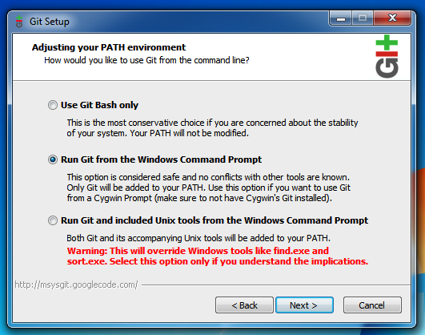

title: Übung Github
parent: uebersicht.md

# Notwendige Vorbereitungen
1. Anlegen eines Benutzeraccounts auf [GitHub](https://github.com)
1. Installation von [VS Code](https://code.visualstudio.com/)
1. Installation von [Git (for Windows)](https://gitforwindows.org/) mit `PATH` Variable (Option 2 oder 3)!

# Übung [Github](https://github.com)
## Teil 1
1. Anlegen des Projektes "WDIC"
1. Anlegen eines *Issues* (z.B. "Improve README")
1. Klonen des Projekts auf den lokalen Computer
1. Hinzufügen einer lokalen Datei
1. `git add`, `git commit`, `git push` kennenlernen
1. Ändern einer Datei direkt über github.com
1. `git pull` kennenlernen
1. Arbeit mit `Branch` und `Tag`
  1. Branch erstellen
  1. Branch pushen
  1. Pull Request erstellen
  1. Pull Request mergen

## Teil 2 (Hausübung)
* Anlegen des Projekts "WDIC_Aufgabe" (Projekt sollte *public* sein)
* Klonen des Projekts auf den lokalen Computer
* Folgenden Text in der README Datei hinzufügen: "Das ist Teil der Hausübung"
* Diese Änderung commiten und pushen
* Einen Branch "Feature 1" erstellen und in diesem Branch weiterarbeiten
* Folgenden Text in der README Datei hinzufügen: "Arbeit an Feature 1"
* Die Änderung commiten und pushen
* Über github.com einen Pull Request erstellen und mergen
* Über Teams Aufgaben den Link auf das Repository mitteilen

# Begriffe
* Commit
* Commit Hash
* Branch
* Mergen
* Merge Request/Pull Request
* Fork