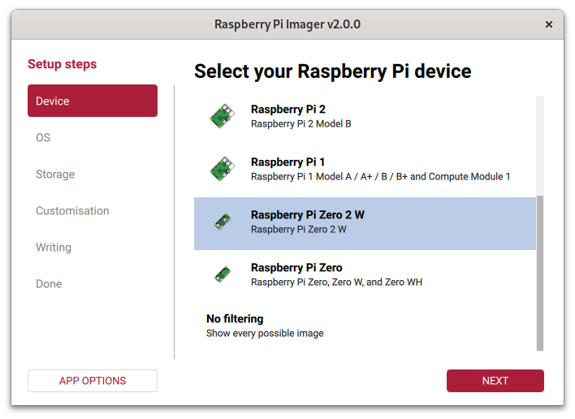
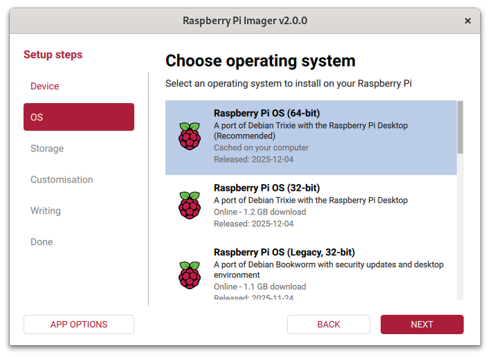
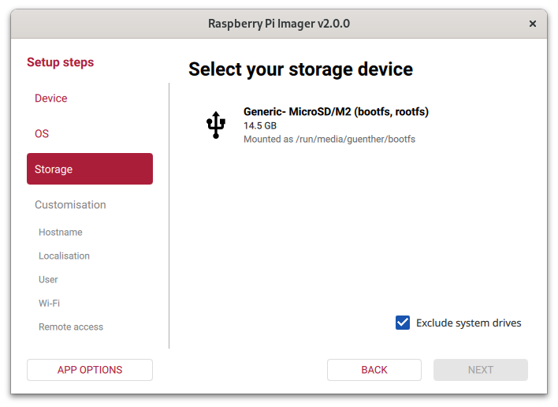
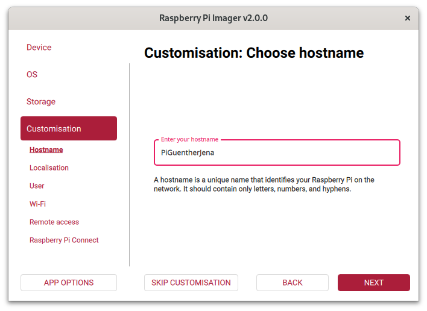
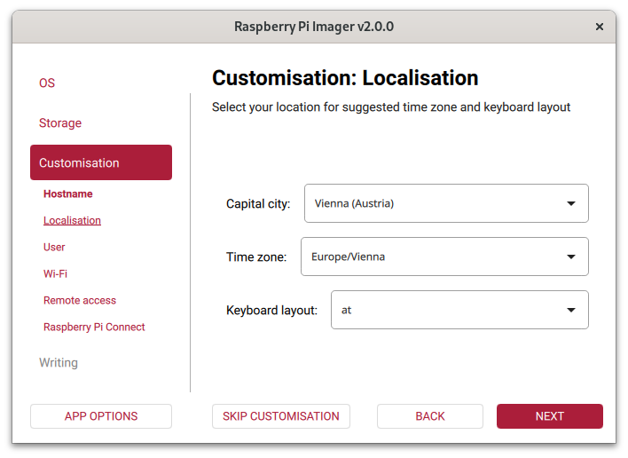
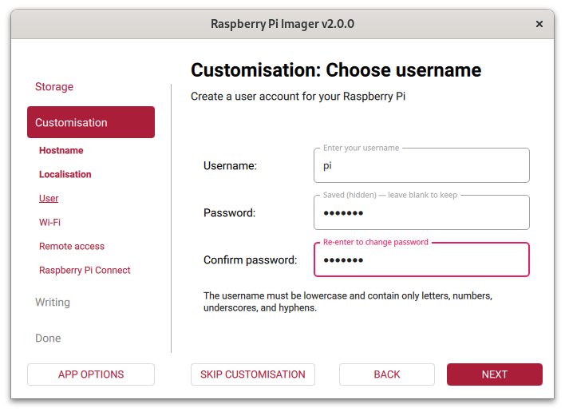
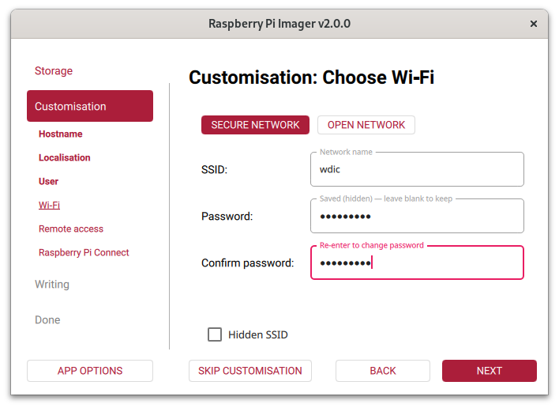
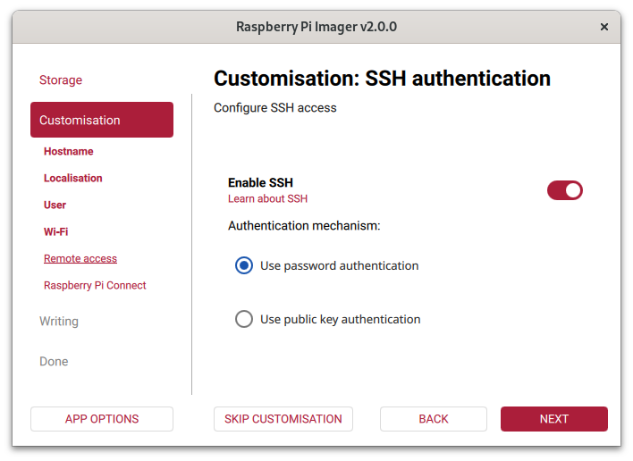
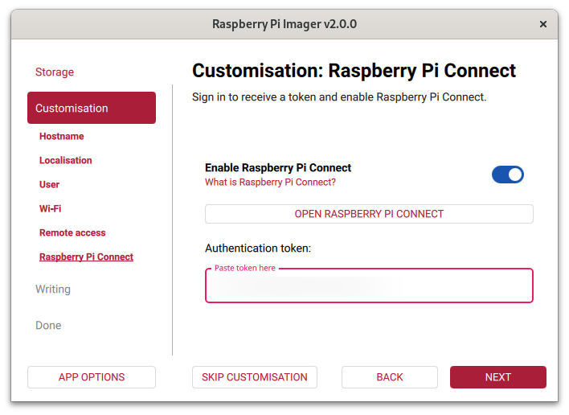

title: RaspberryPi
parent: ../unterricht.md

# Inbetriebnahme
## Vorbereitungen

* Flashen des aktuellen Raspberry Pi OS mittels [Raspberry Pi Imager](https://www.raspberrypi.com/software/)

### Auswahl Device
Wähle "Raspberry Pi Zero 2 W" aus.

### Auswahl OS
Wähle "Raspberry Pi OS (64-bit)" (erster Eintrag) aus.

### Auswahl Speicherkarte
Wähle die entsprechende SD-Karte aus.

### Hostname
Verwende deinen Namen als Hostname, z.B. hier "guentherjena". Punkt und Unterstrich ist nicht erlaubt, aber Bindestrich geht.

### Localisation

### Username und Passwort
Standardmäßig ist der Username "pi" und das Passwort "raspberry". Es kann (und sollte) ein eigenes Passwort gewählt werden.

### WLAN Einstellungen
Trage hier als SSID "wdic" und als Passwort "raspberry" ein.

### SSH aktivieren

### Raspberry Pi Connect
Dieser Schritt ist optional. Es benötigt einen Account bei Raspberry Pi und bietet einen weiteren Weg, sich mit dem Raspberry zu verbinden.

## Verbinden über VS Code
VS Code bietet die Möglichkeit sich per SSH mit dem RaspberryPi zu verbinden und dann direkt auf dem RaspberryPi zu arbeiten. Dazu ist die VS Code Extension **Remote Explorer** und **Remote SSH** notwendig.

Weitere Infos gibt es hier:
* [Raspberry Pi Remote Development Based On VSCode Tutorial](https://www.waveshare.com/wiki/Raspberry_Pi_Remote_Development_Based_On_vscode_Tutorial)
* [https://code.visualstudio.com/docs/remote/ssh](https://code.visualstudio.com/docs/remote/ssh)

## Git `user.name` und `user.email`
Im Terminal (am Raspberry) folgenden Befehl ausführen:
* `git config --global user.name "Max Muster"`
* `git config --global user.email "max@muster.com"`
